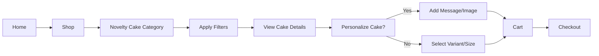
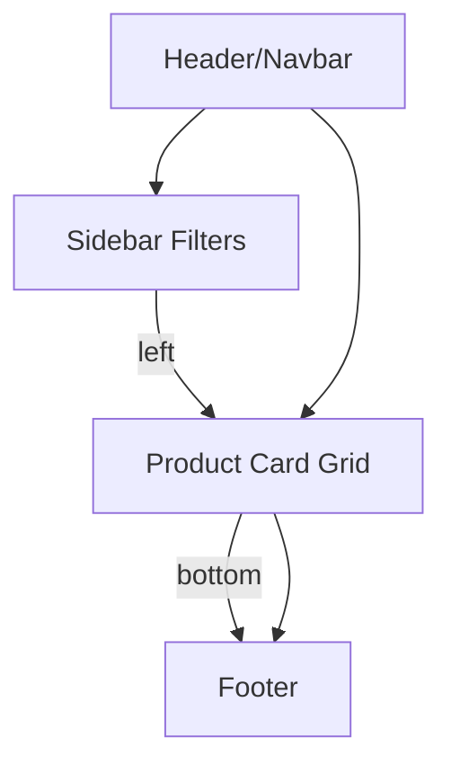

# High-Level Design Spec: Novelty Cake Category

## Color Palette & Style
- **Primary:** #E83C6F (Raspberry Pink)
- **Secondary:** #FDD835 (Lemon Yellow), #FFF3DD (Soft Cream), #2979FF (Icing Blue), #44BFA3 (Spearmint Green)
- **Neutral:** #FAFAFA (off-white bg), #333 (text), #888 (labels/borders)
- **Accent:** #BA68C8 (Lilac/Novelty), white highlights, subtle sprinkles as UI background element
- **Style:** Soft rounded corners, playful icons, minimal shadows, cheerful imagery.

---

## Layouts (Textual Wireframes)

---
### 1. Shop - Novelty Cake Category Page

- **Header/Navbar**
  - Logo | Shop | About | Cake | Cart | Account
- **Breadcrumbs:** Home > Shop > Novelty Cake
- **Left Sidebar:**
  - Filters
    - Occasion (checkboxes)
    - Flavor (checkboxes)
    - Shape/Design (checkboxes)
    - Dietary (checkboxes)
    - Price (slider)
    - Personalized (yes/no)
    - In stock only (toggle)
- **Main Content:**
  - Category title: "Novelty Cakes For Every Occasion"
  - Sort bar: Sort [Newest | Price | Rating]
  - Product card grid (2-4 columns, responsive)
    - Card: Image, title, price, dietary tags, quick add
- **Footer:**
  - Links: Contact, FAQ, Policies, Social icons

---
### 2. Product Detail Page (Cake PDP)

- **Header/Navbar**
- **Breadcrumbs:** Home > Shop > Novelty Cake > [Product]
- **Main Area:**
  - Product gallery (carousel + zoom)
  - Info: title, price, badges (bestseller, seasonal), dietary highlights, serving size
  - Personalization form (show if allowed): text fields, image upload
  - Flavor/size selector
  - Ingredient/allergen/dietary info summary
  - Add to cart, wishlist
  - Delivery estimate, storage guidance
  - Tabs: Description | Reviews | Q&A | Storage & Allergy FAQ
- **Sidebar:**
  - Other recommended cakes
- **Footer**

---
### 3. Admin Novelty Cake Management

- **Top Nav**: Dashboard | Orders | Products | Novelty Cake | Reports
- **Table/List:**
  - Filter/search, bulk actions
  - Columns: Image, Name, Status, Occasions, Price, Inventory, Dietary, Tags, Actions
  - Add/Edit (drawer or modal): Fields for all variant, dietary, seasonal, personalization, SEO
- **CSV/XLSX Import, Batch Edit tools**
- **Validation/Warnings (inline, color-coded)**

---

## UI Elements & Components
- Navbar
- Footer
- Product Card
- Filter Panel (Sidebar)
- Sort Bar
- Product Gallery Carousel
- Personalization Form (conditional, supports photo & text)
- Tags/Badges (Dietary, Bestseller, New, Out-of-Stock)
- Variant Selector (flavor/size)
- Review, Q&A Tabs
- Wishlist/Add To Cart Buttons
- Delivery Date Picker/Estimator
- Admin Table, Bulk Actions, Import/Export

---

## Component Breakdown

- **Navbar**: Logo, Main Nav, Cart, Account
- **Hero/Category Header**: Category title, occasion graphic, tagline
- **Filter Panel**: All filter groups, clear/reset
- **Product Card**: Image, basic info, dietary tags, add button
- **Product Detail: Gallery + Info**
- **Personalization Form**: Only shown if product is personalizable
- **Review/Q&A**
- **Admin List/Table**: Fields, filtering, actions, batch tools
- **Footer**: Company info, policy links, socials

---

## Mermaid Diagrams

### User Journey (Shopper)

### Page Layout: Category

---

## Supporting Files
- See [Figma Draft Designs](https://www.figma.com/file/example-link-novelty-cake-designs) _(placeholder)_
- [colors.json](./colors.json)

---

## Commit Info
- Commit message: "Add high-level design for Product Manager review"

---

## Status
**Design is ready for Product Manager review. Please confirm or request changes.**
