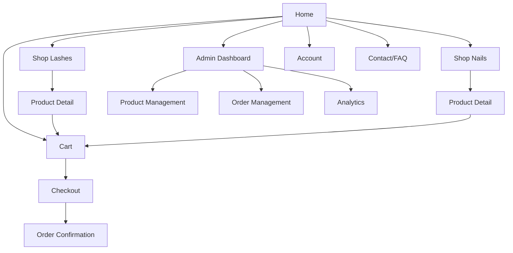

# High-Level Design Spec: Beauty Accessories Store (False Eyelashes & False Nails)

## Color Palette & Style
- **Primary:** Soft pink (#F8E1E7), Blush rose (#F6C5C0)
- **Accent:** Nude beige (#F6EDD9), Metallic gold (#E7C38B), Deep brown (#59443C)
- **Text:** Charcoal (#2D2328), White (#FFFFFF)
- **Style:** Modern, minimal, feminine, white space, soft shadows, elegant UI

---

## Layout Descriptions (Textual Wireframes)

### 1. Homepage
- **Hero Section:** Large banner (eyelash + nail imagery), headline, CTA buttons (Shop Lashes / Shop Nails)
- **Featured Products:** Carousel/grid, mix of top-selling lashes & nails
- **Benefits Bar:** Icons for Shipping, Cruelty-Free, Returns, Secure Payments
- **Categories Preview:** Two large blocks ("Shop Lashes", "Shop Nails")
- **Testimonials:** Customer quotes/images
- **Newsletter Signup:** Email form
- **Footer:** Navigation links, contact, social media

### 2. Product Catalogue
- **Category Tabs or Sidebar:** False Eyelashes | False Nails (toggle)
- **Filter Bar:** Style, length (lashes), finish/shape/color (nails), price, search
- **Product Grid:** Image, name, price, quick add-to-cart

### 3. Product Detail Page
- **Gallery:** Main image, thumbnails
- **Info:** Title, price, description, attributes (style/length/shape), stock
- **Reviews:** Star rating, customer comments
- **Add to Cart:** Quantity selector, button
- **Upsell/Cross-Sell:** Related products

### 4. Shopping Cart
- **Line Items:** Image, name, selected attributes, price, quantity, subtotal
- **Summary:** Total, shipping estimate, checkout button

### 5. Checkout
- **Form:** Address, contact info, shipping method, payment details (Stripe/PayPal), order review

### 6. Order Confirmation
- Order summary, tracking info, continue shopping link

### 7. Admin Dashboard
- **Sidebar Navigation:** Products (Lashes & Nails), Orders, Customers, Analytics
- **Main Area:** Product table, order table, analytics charts

### 8. Shared Components
- **Navbar:** Logo, "Shop Lashes", "Shop Nails", Cart icon, optional account/login
- **Footer:** Standard, social icons, newsletter, legal links

---

## UI Elements Checklist
- Responsive navbar and mobile menu
- Button styles: Primary, secondary, icon buttons
- Product cards, rating stars, badges (New, Best Seller)
- Filter dropdowns, toggles, search bar
- Pagination
- Cart drawer/mini cart
- Modal for login/signup (if included)
- Admin table and edit forms

---

## Component Breakdown
- **Navbar** (main navigation)
- **Hero Section** (homepage)
- **Category Tiles/Grid**
- **ProductCard** (for grid/listing)
- **ProductDetail** (detail info)
- **FilterBar / Filters**
- **CartDrawer / CartPage**
- **CheckoutForm**
- **TestimonialCarousel**
- **NewsletterSignup**
- **Footer** (global)
- **Admin/ProductTable**
- **Admin/OrderTable**
- **Admin/AnalyticsDashboard**

---

## Visual Sitemap (Mermaid)

---

## Next Steps
- Refine category filters for nails (shape, color, finish) in wireframes
- Align product card imagery for both product lines
- Create color tokens & design tokens as JSON if supporting design system
- Add Figma/Canva links here (when available)

---

*Ready for Product Manager review!*