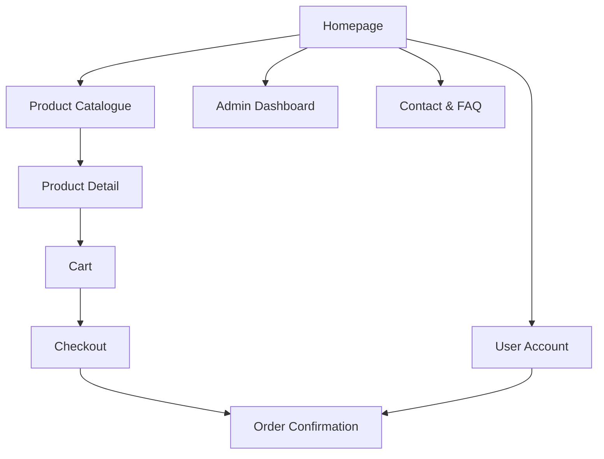

# Product Specification: False Eyelashes E-commerce Website

## Overview

We are building a modern and user-friendly website to sell false eyelashes online. The website will enable users to browse products, view details, add items to cart, make purchases, and manage orders. Website admins can add/update inventory and process orders.

---

## Goals

- Provide a seamless shopping experience for customers interested in false eyelashes.
- Allow for easy product management and order processing for admins.
- Support secure payments and customer communication.
- Mobile responsive design for accessibility.

---

## Target Users

- Consumers interested in beauty products, specifically false eyelashes.
- Small beauty brands/retailers managing their inventory.

---

## Key Features

1. **Homepage**
   - Hero banner, featured products, and call-to-actions.

2. **Product Catalogue**
   - Category filtering, search, sorting (price, popularity).

3. **Product Detail Page**
   - High-quality images, detailed description, price, reviews, Add to Cart.

4. **Shopping Cart**
   - Cart summary, quantity update, remove item, proceed to checkout.

5. **Checkout & Payment**
   - Address form, shipping options, payment integration (Stripe/PayPal).

6. **Order Confirmation & Tracking**
   - Email confirmation, order status page.

7. **Admin Dashboard**
   - Add/edit/delete products, view/manage orders, see sales analytics (basic).

8. **User Account (optional, v1 can support guest checkout)**
   - Register/login, view order history.

9. **Contact & FAQ**
   - Contact form, answers to common questions.

---

## Information Architecture / Site Map

---

## User Stories

### Shopper

- As a user, I can browse false eyelashes by style, length, and price.
- As a user, I can view details and photos of each product.
- As a user, I can add or remove items from my shopping cart.
- As a user, I can securely purchase items using my credit card or PayPal.
- As a user, I receive an email confirmation of my order.
- As a returning user, I can log in and view my previous orders (optional).

### Admin

- As an admin, I can add new products with detailed info and images.
- As an admin, I can edit or delete products.
- As an admin, I can view customer orders and update their status.
- As an admin, I can see basic sales analytics or reports.

---

## UI/UX Suggestions

- Clean, modern, beauty-focused look (soft colors, high-resolution imagery).
- Mobile-first responsive design.
- Quick add-to-cart buttons, visible pricing and shipping info.
- Trust-building (testimonials, reviews, secure checkout badges).

---

## Technology Recommendations

- **Frontend:** React.js, Next.js, or Vue.js.
- **Backend:** Node.js/Express or Python/Django.
- **Database:** PostgreSQL or MongoDB.
- **Payment:** Stripe or PayPal integration.
- **Hosting:** Vercel, Netlify, or AWS.
- **CMS for products (optional):** Sanity, Contentful, or use internal dashboard.

---

## MVP (Minimum Viable Product) Scope

- Homepage, product catalogue & details, cart, checkout/payment, order confirmation, admin dashboard.
- User authentication can be optional at launch.
- Contact form with email notifications.

---

## Stretch Goals

- Product ratings and reviews.
- Wishlist/favorites.
- Advanced analytics.
- Loyalty points or discount system.

---

## Acceptance Criteria

- Users can browse, view, and purchase products end-to-end.
- Admins can manage inventory and orders.
- All forms validated and errors handled gracefully.
- Website is secure (SSL, secure payment flows).
- Website is mobile responsive.

---

## Next Steps

- Wireframe key screens.
- Define product and order data models.
- Set up repository and project board for tasks.
- Proceed with UI design and development iterations.

---
