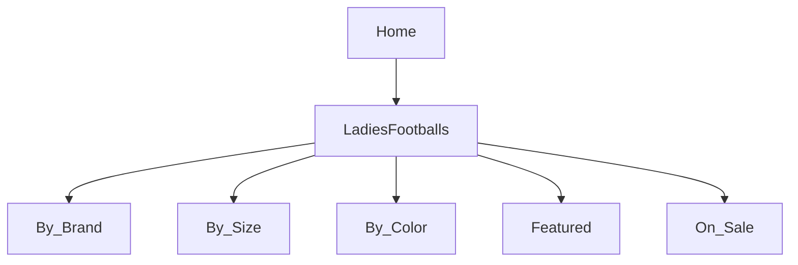
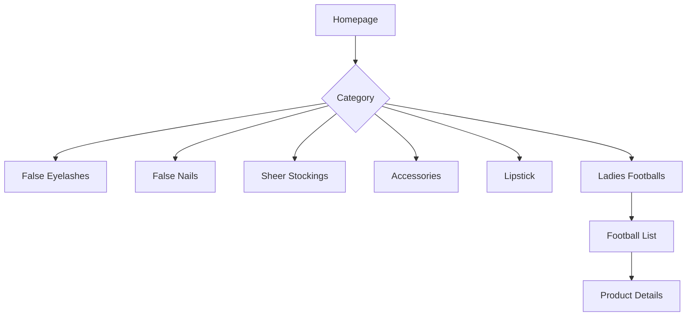

# Product Specification Update: Ladies Footballs Category
_Repository: [false-eyelash-store](https://github.com/misterfitzy/false-eyelash-store)_  
_Spec Path: specs/product-spec.md_  
_Date: 2026-04-27_

---

## 1. Objective

- Add "Ladies Footballs" as a prominent new category to the store.
- Ensure discoverability, robust filtering, and seamless purchasing for shoppers.
- Enable complete admin management for all Ladies Footballs SKUs and attributes.
- Maintain UX consistency, accessibility, and mobile responsiveness.
- Ensure extensibility for future sporting goods or related categories.

---

## 2. Store Navigation & Catalog Structure

**Ladies Footballs** is a top-level navigation tab, appearing alongside:
- False Eyelashes
- False Nails
- Sheer Stockings
- Hair Dye
- High Rise Jeans
- Lipstick
- Accessories (eyelash curlers, removers, etc.)
- **Ladies Footballs** _(new)_



### Catalog Navigation & Filtering
- Ladies Footballs have a dedicated menu/category landing page.
- Filtering and sorting options:
  - **Brand** (Nike, Adidas, Mitre, etc.)
  - **Size** (e.g., Size 4, Size 5)
  - **Color/Pattern** (Pink, Floral, Custom prints)
  - **Material** (PU, PVC, Synthetic Leather, etc.)
  - **Features** (Lightweight, Training, Match-play, Indoor/Outdoor, etc.)
  - **Price Range**
  - **In Stock Only**
- Results update in real-time; filter bar follows mobile/desktop best practices.

---

## 3. Product Data Model Expansion

Extend the `Product` schema:

```json
{
  "id": "string",
  "name": "UltraGrip Ladies Football",
  "category": "Ladies Footballs",
  "brand": "string",
  "description": "string",
  "images": ["string"],
  "price": 00.00,
  "stock": 0,
  "attributes": {
    "size": "string",
    "color_pattern": "string",
    "material": "string",
    "features": ["string"],
    "usage": ["Training", "Match-play", "Indoor", "Outdoor"],
    "weight": "number (g)"
  }
}
```

---

## 4. Product Detail Page Requirements

- All specific attributes displayed (size, color, material, features, images, usage).
- Alt text for accessibility on all images.
- Add to Cart, Wishlist, Reviews/Q&A integration.
- Display of relevant badges (e.g., Best Seller, New Arrivals, On Sale).

---

## 5. Admin Management Features

- Full CRUD for Ladies Footballs and all football-specific attributes.
- Bulk import/export (CSV/XLSX) of product data.
- Admin filter management (add/remove size, color, material, feature, brand values).
- Real-time inventory tracking and sales reporting for the new category.
- Assignment of badges (e.g., Featured, New, Hidden, etc.).

---

## 6. User Stories & Flows

**Shopper**
- As a shopper, I can find Ladies Footballs in the main navigation and browse them easily.
- I can filter, view, and add Ladies Footballs to the basket along with other products.
- I see all football attributes and care info before I buy.

**Admin**
- As an admin, I can create, edit, publish, and manage footballs and all attributes.
- I can use bulk tools to update stock, import new products, or revise attributes/filters.

---

## 7. Acceptance Criteria

- [ ] Ladies Footballs tab appears in top navigation, is browseable/searchable.
- [ ] Category supports catalog filtering (size, color, brand, etc.) and sorting.
- [ ] Product detail pages for footballs show all required attributes, images, badges, and accessibility features.
- [ ] Football SKUs manageable via admin interface, with import/export and reporting.
- [ ] Mixed-category checkout works as expected (football + lashes, etc.).
- [ ] Full mobile-responsiveness and accessibility for all interfaces updated.

---

## 8. Visual Structure (Mermaid Candidate)



---

## 9. Next Steps

1. Approve/approve edits to this spec.
2. Update wireframes and UI assets for Ladies Footballs.
3. Implement supporting feature stories and integration tests.

---

**Added by product team on 2026-04-27 for immediate implementation.**
