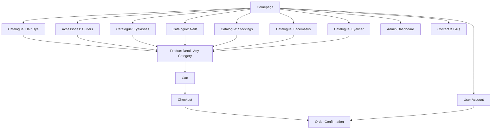

# Product Specification: Beauty Accessories E-commerce (False Eyelashes, False Nails, Sheer Stockings, Facemasks, Eyeliner, Eyelash Curlers, Hair Dye)

## Overview

Enhance the e-commerce platform to support an additional core category: **Hair Dye**. Users should be able to find, filter, and shop for hair dye, and admins should manage hair dye inventory seamlessly alongside existing categories: false eyelashes, false nails, sheer stockings, facemasks, eyeliner, and accessories (such as eyelash curlers).

---

## Goals

- Provide a seamless shopping experience for customers interested in purchasing hair dye in addition to current beauty/fashion items.
- Allow for efficient product management and order processing for hair dye alongside other categories.
- Support mixed-category carts and a consistent admin experience.
- Continue supporting secure payments, mobile responsiveness, and accessibility.

---

## Target Users

- Beauty and fashion shoppers interested in hair dye and related beauty/fashion products.
- Small brands/retailers managing beauty/fashion and hair care products.

---

## Key Features

1. **Homepage**
   - Hero banners, featured products sampled from all categories, and clear navigation—including Hair Dye.

2. **Product Catalogue**
   - Category switcher/tabs/sidebar: "False Eyelashes", "False Nails", "Sheer Stockings", "Facemasks", "Eyeliner", "Accessories", **"Hair Dye"**.
   - Catalogue for each category—including hair dye.
   - Filtering/sorting per category.
   - **Hair Dye Filters**: color (swatch picker), brand, type (permanent, semi-permanent, temporary, root touch-up), format (cream, gel, foam, powder), ammonia-free, vegan/cruelty-free, price, rating.

3. **Product Detail Page**
   - High-res photos, full description, price, and selection for color, brand, type, variant.
   - Swatch/color picker for hair dye.
   - Ingredients, instructions, suitability, category label and breadcrumbs.
   - Reviews, ratings, and Add to Cart.

4. **Shopping Cart**
   - Supports mixed-product carts across all categories.
   - Quantity and attribute selection visible per item (e.g., chosen hair dye color/type).

5. **Checkout & Payment**
   - Multi-category purchasing is supported with no workflow change.

6. **Order Confirmation & Tracking**
   - Orders include hair dye line items where applicable.

7. **Admin Dashboard**
   - Manage all categories, including hair dye.
   - Add/edit/delete hair dye products; fields: name, color(s), brand, type, format, ammonia-free, vegan, price, stock, images, ingredients, application instructions, tags.
   - Manage orders including those with multi-category products.
   - Inventory tracking and category/brand/color-specific reporting for hair dye.

8. **User Account (optional)**
   - Display hair dye purchase history.

9. **Contact & FAQ**
   - Expanded with advice for hair dye selection, use, and aftercare.

---

## Information Architecture / Site Map



---

## Data Model: Hair Dye Example

```json
{
  "category": "hair-dye",
  "name": "Vibrant Blue Semi-Permanent Hair Color",
  "brand": "ColorBliss",
  "type": "semi-permanent",
  "formats": ["cream", "gel"],
  "swatches": [
    {"colorName": "Vibrant Blue", "hex": "#3B5BA6", "image": "blue.jpg"}
  ],
  "ammoniaFree": true,
  "vegan": true,
  "price": 12.95,
  "rating": 4.6,
  "stock": 35,
  "images": ["main.jpg", "blue.jpg"],
  "ingredients": "Aqua, Cetearyl Alcohol, Behentrimonium Chloride, Basic Blue 99, ...",
  "instructions": "Apply to damp hair, leave for 20 mins...",
  "description": "Long-lasting, bold dye. No ammonia. Vegan."
}
```

---

## User Stories

### Shopper
- As a user, I can browse the Hair Dye section and view all available shades/brands.
- As a user, I can filter by color, brand, type, etc., select a shade, and see images/ingredients.
- As a user, I can add hair dye to my cart and purchase it with other products.

### Admin
- As an admin, I can add, edit, and remove hair dye listings with all relevant attributes.
- As an admin, I can track inventory, manage pricing, and analyze item sales for hair dye.
- As an admin, I can bulk upload/update hair dye SKUs and variants.

---

## UI/UX Suggestions

- Navigation bar shows Hair Dye as a main category; clear and visually consistent with others.
- Hair dye filter panel with color swatches (visual selector) and brand/type toggles.
- Dye detail page highlights shade, brand, features, application tips, and ingredients.
- Mobile-responsive layouts for all new filter and product detail views; accessible design.

---

## Acceptance Criteria

- Hair Dye is visible in main and catalogue navigation with all relevant filters.
- Filtering, detail, admin, cart, and checkout flows support hair dye fully.
- Orders, reporting, and admin modules include hair dye data.
- No regression to other core categories; workflows remain consistent.
- Mobile responsiveness and accessibility maintained for all flows.

---

## Next Steps

1. Review and approve this updated spec.
2. Update wireframes/UI to include the Hair Dye category and filter options.
3. Extend product and order data models.
4. Implement UI/backend/admin panel changes for hair dye.
5. QA mixed baskets, filtering, purchase, and admin flows including hair dye.

---

## Change Log
- 2026-02-17: Dual category (lashes/nails) support added.
- 2026-03-xx: Sheer stockings added as third category.
- 2026-04-xx: Facemasks added as fourth category.
- 2026-06-xx: Eyeliner added as fifth category.
- 2026-07-xx: Eyelash curlers/support for Accessories added.
- 2026-08-xx: Hair Dye category added as main offering, with catalog, filter, admin, and purchasing support.

---

**End of Spec Update**

Visible: 0% - 100%
