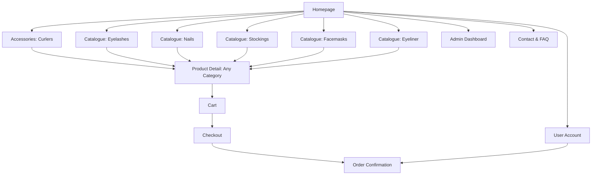

# Product Specification: Beauty Accessories E-commerce (False Eyelashes, False Nails, Sheer Stockings, Facemasks, Eyeliner, Eyelash Curlers)

## Overview

Enhance the e-commerce platform to support an additional core subcategory: **Eyelash Curlers** under Accessories. Users should be able to find, filter, shop, and admins should manage eyelash curlers seamlessly alongside false eyelashes, false nails, sheer stockings, facemasks, and eyeliner.

---

## Goals

- Provide a seamless shopping experience for customers interested in false eyelashes, false nails, sheer stockings, facemasks, eyeliner, and eyelash curlers.
- Allow for efficient product management and order processing for all categories.
- Support mixed-category carts and a consistent admin experience.
- Continue supporting secure payments, mobile responsiveness, and accessibility.

---

## Target Users

- Beauty and fashion shoppers interested in lashes, nails, stockings, facemasks, eyeliner, or accessories.
- Small brands/retailers managing these beauty/fashion products.

---

## Key Features

1. **Homepage**
   - Hero banners, featured products sampled from all categories, and clear navigation.

2. **Product Catalogue**
   - Category switcher/tabs/sidebar: "False Eyelashes", "False Nails", "Sheer Stockings", "Facemasks", "Eyeliner", **"Accessories"** (inc. Curlers).
   - Catalogue for each category—including eyelash curlers.
   - Filtering/sorting per category.
   - **Eyelash Curler Filters**: brand, material, color, features (heated, ergonomic, mini), price.

3. **Product Detail Page**
   - High-res photos, full description, price, and selection for category-relevant options.
   - Category label and breadcrumbs.
   - Reviews, ratings, and Add to Cart.

4. **Shopping Cart**
   - Supports mixed-product carts across all categories.
   - Quantity and attribute selection visible per item.

5. **Checkout & Payment**
   - Multi-category purchasing is supported with no workflow change.

6. **Order Confirmation & Tracking**
   - Orders include eyelash curler line items where applicable.

7. **Admin Dashboard**
   - Manage all categories, including eyelash curlers under Accessories.
   - Add/edit/delete curler products; fields: name, description, photos, SKU, price, stock, brand, material, features, color, tags.
   - Manage orders including those with multi-category products.

8. **User Account (optional)**
   - Display curler purchase history.

9. **Contact & FAQ**
   - Expanded with advice for curler use and care.

---

## Information Architecture / Site Map



---

## Data Model: Eyelash Curler Example

```json
{
  "category": "accessories-curlers",
  "name": "Ultra Precision Eyelash Curler",
  "images": ["curler1.png", "curler2.png"],
  "price": 9.99,
  "stock": 150,
  "attributes": {
    "brand": "LashPro",
    "material": "Stainless Steel",
    "color": "Silver",
    "heated": false,
    "features": ["ergonomic", "mini"],
    "compatibleWith": ["false eyelashes"]
  },
  "description": "Professional-grade curler designed for comfort and precision."
}
```

---

## User Stories

### Shopper
- As a user, I can browse the Accessories section and view eyelash curlers.
- As a user, I can filter curlers by brand, material, color, feature, and price.
- As a user, I can add curlers to my cart and purchase them with other products.

### Admin
- As an admin, I can add, edit, and remove eyelash curler listings with all relevant attributes.
- As an admin, I can track inventory, manage pricing, and analyze item sales for curlers.

---

## UI/UX Suggestions

- Navigation bar shows Accessories with Curlers as a clear section.
- Accessory filters are consistent and visible on desktop; collapsible on mobile.
- Curler product cards match store style, with attribute highlights (heated, ergonomic, etc).
- Mobile-responsive and accessible per store baseline.

---

## Acceptance Criteria

- Eyelash curlers/Accessories are visible throughout catalog navigation.
- Filtering, detail, admin, cart, and checkout flows support curlers fully.
- Orders, reporting, and admin modules include curler data.
- No regression to other core categories.
- Mobile responsiveness and accessibility maintained.

---

## Next Steps

1. Review and approve this updated spec.
2. Update/create wireframes for the Accessories/curlers flows.
3. Extend product and order data models.
4. Implement UI/backend/admin panel changes for Accessories/curlers.
5. QA mixed baskets, filtering, purchase, and admin flows including curlers.

---

## Change Log
- 2026-02-17: Dual category (lashes/nails) support added.
- 2026-03-xx: Sheer stockings added as third category.
- 2026-04-xx: Facemasks added as fourth category; catalogue, detail, filter, admin, and purchasing flows updated.
- 2026-06-xx: Eyeliner added as fifth category.
- 2026-07-xx: Eyelash curlers/support for Accessories added as new category/subcategory.

---

**End of Spec Update**
