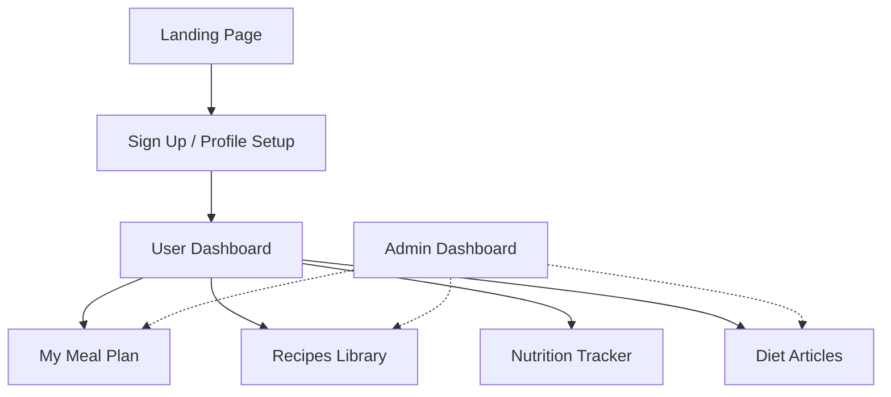
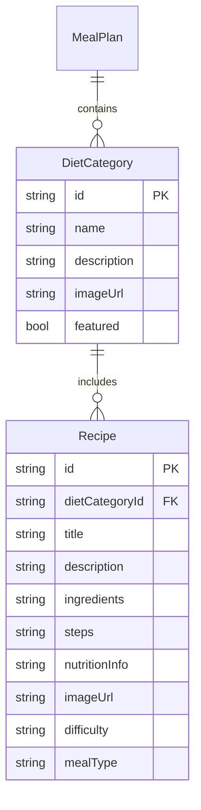
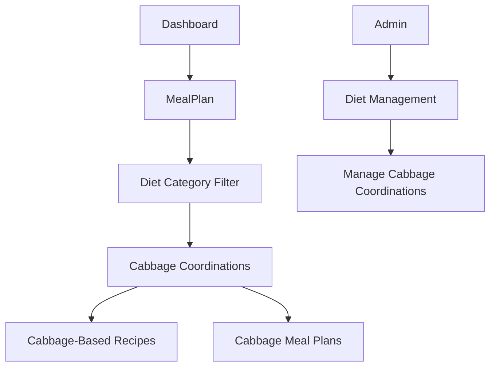

# Product Specification: Diet Guide for Ladies

## 1. Product Overview

The **Diet Guide for Ladies** is a responsive web application that empowers women to achieve their dietary and wellness goals. It provides personalized meal plans, healthy recipes, trackable nutrition goals, and vetted advice specific to women's life stages and health objectives.

---

## 2. Target Users

- Women aged 18-60
- Primary goals: wellness, weight loss, weight gain, fitness, special conditions (e.g., pregnancy, menopause, PCOS, etc.)
- Comfort with digital solutions; varying nutrition knowledge

---

## 3. Core Features

### A. Personalized Diet Plans
- Intake: age, height, weight, dietary preferences (vegan, vegetarian, gluten-free), allergies, health goals
- Output: customizable meal plans, dynamic adjustment (e.g., “swap meal”)
- Macronutrient targets and portion suggestions

### B. Recipe Library
- Curated, filterable recipes by meal, cuisine, prep time, dietary restriction
- Nutritional breakdown (calories, protein, fat, fiber, etc.)

### C. Nutrition Tracking
- Daily/weekly progress dashboard
- Input foods eaten, sync with meal plan, visualizations (charts, streaks)

### D. Educational Content
- Science-backed articles, FAQs, mythbusting
- Guides for common women’s health conditions (PMS, menopause, pregnancy, PCOS, etc.)

### E. Community & Support (Phase 2)
- Optional: Q&A forum, group challenges, share progress

---

## 4. User Stories

**As a new user:**
- I can sign up and set my health goal (e.g., tone up, lose weight, hormone balance).
- I can specify dietary restrictions and allergies.
- I can receive a tailored meal plan instantly.

**As a returning user:**
- I can view and swap upcoming meals for alternatives.
- I can log my food, view my progress, and see how I'm tracking toward my goal.
- I can browse and save favorite recipes.

**As a content admin:**
- I can add/edit diet plans, recipes, and articles via a secure dashboard.

---

## 5. Information Architecture/Site Map

---

## 6. Data Model (sample, extensible)

### User
- id, email, password (hashed), profile: {age, height, weight, preferences, restrictions, health goals}, favorites[], progress[]

### MealPlan
- id, user_id, start_date, days[{date, meals[]}]

### Recipe
- id, name, ingredients[], instructions, nutrition_info, tags[], prep_time, author

### Article
- id, title, body, tags[], related_conditions[], author

---

## 7. UX/UI Guidance

- Warm, welcoming palette, inclusive photography/illustrations
- Onboarding flow for profile setup
- Clear CTAs (“Get Your Plan”, “Log Meal”, “Swap Recipe”)
- Accessible forms, readable fonts, minimized cognitive load
- Mobile-first responsive layouts
- Dietary restriction support at every meal/recipe node

---

## 8. Acceptance Criteria

- Users receive instant, personalized meal plans based on input
- Nutrition info visible, accurate, and adjustable by user
- Recipes, plans, and articles are filterable and searchable
- Admin can manage content via dashboard (CRUD)
- App is mobile-friendly and WCAG 2.1 AA compliant
- All user data is secure and private

---

## 9. Next Steps

- Review and approve full specification
- Create wireframes/UI mockups for onboarding, meal plan, and recipe flow
- Finalize data model and meal plan generation logic
- Begin development sprints (MVP: personalized plans, recipes, nutrition tracker)
- Plan for phased rollout: core features, then community/support if desired

---

## 10. Change Log

- v1.0: Initial product specification, 2026-02-21

---

## 11. Feature Extension: Diet Cabbage Coordinations

**Goal:**  
Introduce "Cabbage Coordinations" as a new filterable diet category, supporting both the shopper and admin experience with consistent accessibility and management features.

---

### 11.1 Functional Enhancements

#### Shopper Experience

- "Cabbage Coordinations" available as a diet filter in all meal plan and recipe search tools.
- Curated cabbage-centric meal plans and recipes, with nutritional info, ingredients, and clear preparation steps.
- Accessible, mobile-responsive pages and modals.
- Actions: "Add to Plan", "Save for Later", full tagging support.

#### Admin Experience

- Complete CRUD access to "Cabbage Coordinations" diet plans and recipes from the admin dashboard.
- Ability to bulk import and export cabbage-based content.
- Apply "Featured" badge, manage visibility, and attach educational guides.

---

### 11.2 Data Model Update

Additions/Updates to the existing model:

> New value:  
> `DietCategory.name = "Cabbage Coordinations"`

---

### 11.3 User Stories

- **As a user,** I can filter for cabbage-based meal plans and recipes.
- **As a user,** I can add cabbage-based meals to my plan.
- **As an admin,** I manage (add, edit, feature, remove) Cabbage Coordinations content from the existing dashboard.

---

### 11.4 Acceptance Criteria

- [ ] "Cabbage Coordinations" selectable on all relevant UI filters/menus.
- [ ] Recipes and meal plans visible/searchable and display with correct details.
- [ ] Admin can fully manage Cabbage Coordinations content.
- [ ] Accessibility, mobile support, and platform styling are maintained.

---

### 11.5 Information Architecture Update

---

### 11.6 Change Log

- v1.1: Added Cabbage Coordinations diet category feature. (2026-02-21)

---

This addition is ready for design and implementation review.
