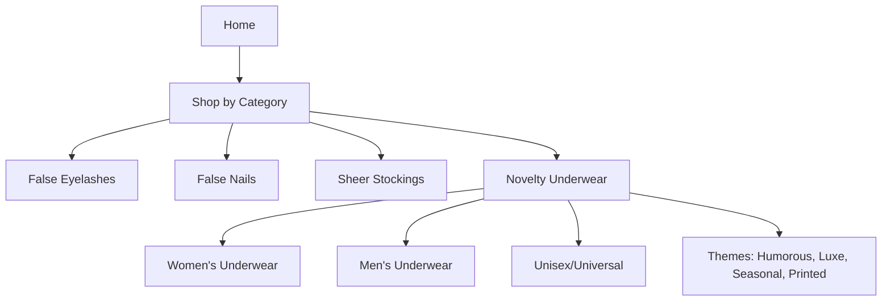

# Product Specification: Novelty Underwear

## 1. Overview

**Goal:**  
Expand the false-eyelash-store platform to offer a new “Novelty Underwear” product category, supporting both unique/printed and standard underwear styles for women, men, and unisex shoppers. Ensure the new category is fully filterable, shoppable, and manageable via admin workflows.

---

## 2. Catalog Structure & Navigation

- Add "Novelty Underwear" as a primary or sub-category (configurable: could nest under Accessories or create as a standalone category).
- Appears in the main/top-level catalog navigation and homepage highlights.
- Fully integrated into sitewide search, filtering, and shop-by-category menus.
- Enables "shop all underwear" and specialty sections (e.g., Valentine’s, Humorous Prints, Luxe Fabrics).

**Mermaid Diagram:**


---

## 3. Shopper Features

- Browse by category, gender, and “theme” (e.g., humorous, romantic, quirky, holiday).
- Advanced Filtering:
    - Size (XS–XXL, numeric by brand & market region)
    - Style (boxer, brief, thong, bikini, hipster, trunk, etc.)
    - Material (cotton, silk, lace, spandex, novelty fabrics)
    - Print/Design (solid, printed, embroidered, novelty graphics)
    - Color(s)
    - Brand
    - Price
    - Rating
    - Stock status
    - Features (tagless, seamless, moisture-wicking, eco-friendly, limited edition, etc.)
- Sorting: price, popularity, new, top-rated, in stock.
- Product Detail: size chart, multiple images/zoom, materials, care instructions, fit notes, model photos, “shop the look”, related items.
- Variant selector for size, color, print, or “edition.”
- Add to cart, wishlist, share, quick view.
- Live stock indication—variant-specific.
- Reviews, Q&A, cross-sell suggestions.
- Accessibility: keyboard navigation, contrast, alt text, ARIA, error states, WCAG 2.1 AA.

---

## 4. Admin Features

- Full CRUD (create/read/update/delete) controls for novelty underwear SKUs.
- Bulk product import/export and variant/batch editing (spreadsheet-like).
- Tagging for seasons/promotions/themes (e.g., “Pride”, “Christmas”, “Shimmer”, “Glow in the Dark”).
- Deactivate/discontinue individual products/variants.
- Inventory and sales reporting.
- Validation for required fields: size, category, images, pricing, variant options, accessibility metadata.
- Rapid-edit for pricing, inventory, tags.
- Asset management for high-res/compliance-ready images.

---

## 5. Data Model

**Example (JSON):**
```json
{
  "id": "nu-001",
  "name": "Novelty Printed Boxer Shorts",
  "category": "Novelty Underwear",
  "subcategory": "Men's Underwear",
  "brand": "FunWear",
  "material": ["Cotton", "Spandex"],
  "styles": ["Boxer", "Printed"],
  "print_type": "Humorous - Pizza Party",
  "color": ["Blue", "Red", "Multi"],
  "sizes": ["S", "M", "L", "XL"],
  "features": ["Tagless", "Machine-Washable", "Seasonal"],
  "price": 12.99,
  "variants": [
    {
      "size": "M",
      "color": "Blue",
      "sku": "nu-001-blu-m",
      "stock": 24
    },
    {
      "size": "L",
      "color": "Red",
      "sku": "nu-001-red-l",
      "stock": 5
    }
  ],
  "images": [
    {
      "url": "https://cdn.site.com/products/nu-001/main.jpg",
      "alt": "Novelty boxer with pizza print"
    }
  ],
  "description": "Lightweight cotton boxers with an all-over pizza print. Elasticated and tag-free for comfort.",
  "care_instructions": "Machine wash cold. Tumble dry low.",
  "rating": 4.7,
  "reviews_count": 52,
  "tags": ["Humorous", "Printed", "Men's", "Valentine's Day"]
}
```

---

## 6. Acceptance Criteria

**Shopper**
- Can find “Novelty Underwear” in main navigation and output in “shop all” and search.
- Can filter & sort by all listed filters.
- Product page shows images (with alt text), variants, size/fit info, care, price, reviews, and related products.
- Can add to cart, wishlist, and see live stock.
- Checkout & account flows are fully compatible.

**Admin**
- Can create/edit/delete underwear products/variants.
- Can bulk import, tag, batch-edit, and filter.
- Can manage inventory, deactivate SKUs, and see sales/inventory reports.

**Accessibility**
- Meets WCAG 2.1 AA
- Keyboard accessible, labeled fields/images, proper tab order, errors flagged clearly.

---

## 7. User Stories

**Shopper**
- As a shopper, I want to browse and filter novelty underwear by size, style, and print/theme so I can quickly find what suits my preferences.
- As a user, I want to view detailed images and info for each product so I can make an informed purchase.
- As a customer, I want to add underwear to my cart and purchase seamlessly across categories.

**Admin**
- As an admin, I want to manage all attributes of underwear products, including print/theme tags and variants, so I can keep the catalog accurate and engaging.
- As an admin, I want to disable or promote specialty underwear for sales and campaigns.

---

## 8. Accessibility & Compliance

- All features, forms, and product cards must be fully keyboard-accessible and readable by screen readers.
- Alt text for all imagery, ARIA where needed, high-contrast, and error states for forms.
- All catalog, detail, and admin flows must meet or exceed WCAG 2.1 AA.

---

## 9. Next Steps

1. Confirm catalog taxonomy & placement (“Novelty Underwear” as top-level or sub-category).
2. Update wireframes for navigation, catalog, product detail, and admin CRUD/batch-edit screens.
3. Extend product data model and filtering in the codebase.
4. Implement admin workflows for batch input/edit of underwear products.
5. Validate compliance/accessibility.
6. QA user flows for admin/shopper roles.
7. Plan launch campaign and highlight section for new category.

---

## 10. Change History

- **2026-02-21**: Initial specification for Novelty Underwear category created.

---

### Ready for design review and development.
