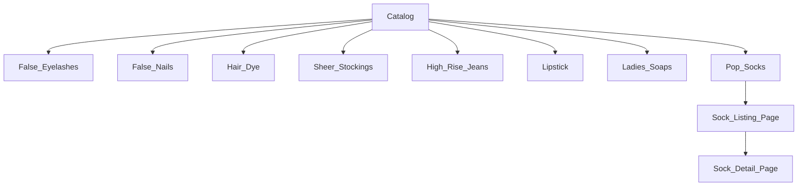

# Product Specification Addendum: Pop Socks Mark 2

**Repository:** [`misterfitzy/false-eyelash-store`](https://github.com/misterfitzy/false-eyelash-store)  
**Spec Location:** `specs/product-spec.md`  
**Date:** 21-Feb-2026

---

## Overview

**Pop Socks Mark 2** introduces an advanced, filterable, and scalable product line into the store. The new spec includes richer variant management, improved taxonomy, new filter dimensions, extended admin tooling, and a refined user experience.

---

## Catalog & Navigation

- Pop Socks Mark 2 is a primary, filterable catalog category at top navigation level.
- Catalog structure (example):



---

## Shopper Features & Filters

**Filter dimensions (updated):**
- Brand
- Style/Pattern (e.g. Dots, Stripes, Graphics, Plain)
- Color(s)
- Size (One Size / S/M/L/XL / EU/UK/US socks sizing)
- Length (Ankle, Crew, Knee-high, Over-the-knee, No-show)
- Material(s) (e.g. Cotton, Bamboo, Nylon blends, Recycled)
- Special Features (Compression, Moisture-wicking, Thermal, Seamless toe, Anti-slip)
- Target (Unisex, Ladies, Men’s, Kids, Sports, Performance, Fashion, Diabetic)
- Eco/Vegan status
- Multipack (Single, 3-pack, 5-pack, etc.)
- Price range
- Rating
- Stock status

**Sort options:** Price, Newest, Best Rated, Trending

Advanced:
- Filter by “Sock Technology” or “Mark 2” feature tag (e.g. “Odor-control tech”, “Reinforced heel/toe”)

---

## Product Detail Page

- Variant selectors (color, style, size, multipack)
- High-res hero image with zoom
- Additional image reel for photos, packaging, close-ups
- “Mark 2” technology badge and modal with explanation
- Care instructions, fit & size guide
- Add to cart, wish list, buy now

---

## Product Data Model

Example (YAML style):

```yaml
id: 'sock-524'
category: 'pop-socks'
subcategory: 'mark-2'
brand: 'SockyPop'
name: "Pop Socks Mark 2 – Bamboo Blend Crew"
technology_tags: ['Mark 2', 'Odor-Control', 'Reinforced Heel/Toe']
variant_options:
  size: ['S', 'M', 'L', 'XL']
  color: ['Rainbow', 'Black', 'White', 'Dotty']
  multipack: ['single', '3-pack']
material: ['Bamboo', 'Polyamide', 'Elastane']
pattern: 'Rainbow'
features: ['Thermal', 'Moisture-Wicking', 'Seamless Toe']
gender_target: ['Unisex']
eco: True
vegan: True
price: 7.99
rating: 4.8
images: ['pop-sock-mark2-front.jpg', ...]
sku: 'SPM2-CRWB-S'
inventory: 128
description: |
  Our Mark 2 crew socks combine bamboo softness with advanced odor control...
care: "Machine wash cool, tumble dry low"
```

---

## Admin Features

**Control Panel:**
- CRUD for Pop Socks Mark 2, incl. full variant matrices
- Bulk import/export (CSV/Spreadsheet) with validation for new filter fields
- Batch editing (all Mark 2 socks, or by brand/feature)
- Inventory min/max alerts by base product + variant
- Inline image management and media ordering
- Batch publishing/unpublishing
- Product analytics/reporting (Mark 2 filter available)

---

## User Stories

**Shoppers**
- As a shopper, I can filter for “Mark 2” socks by brand, pattern, size, features, and length.
- As a shopper, I see “Mark 2” badges and detailed tech modals on applicable socks.
- As a shopper, I can easily add multiple Mark 2 color/size variants to cart.
- As a shopper, Pop Socks Mark 2 can be checked out with items from other categories.

**Admins**
- As an admin, I can add/edit/delete Mark 2 Pop Socks and upload all images/media.
- As an admin, I can import/export Mark 2 Pop Sock SKUs with all filter fields mapped.
- As an admin, I receive alerts when Mark 2 variants go out of stock.
- As an admin, I can report on Mark 2 sales by brand, tech feature, size, and color.

---

## Acceptance Criteria

- Pop Socks Mark 2 visible at top-level navigation and as a filter
- All filter/search/sort options above fully available
- PDP displays variant selectors, “Mark 2” badges, and tech info
- Admin dashboard supports full CRUD + bulk actions for new data fields
- Responsive/mobile-friendly and fully accessible
- Can mix Mark 2 Pop Socks with other categories in one cart/checkout
- ADA/WCAG-compliant: accessible filters, labels, and imagery

---

## UI/UX Guidance

- Use reusable filter panels styled to match core store, with distinct “Sock Technology” or “Mark 2 Features” quick-filters.
- “Mark 2” tech badge clickable opens a modal with info, images, comparison to Mark 1.
- Size guides and material facts easily accessible.
- High-res image zoom, carousel, and variant thumbnail display.
- All core interactions accessible by keyboard and screen reader.

---

## Next Steps

- [ ] Review and update wireframes for Pop Socks Mark 2
- [ ] Add to `specs/product-spec.md` in the repository
- [ ] Prepare mockups for tech badge/modal, sock variant selectors, and filter panel extensions

---

**Ready for UI design and implementation. Would you like to review draft wireframes or proceed with another new category/product?**
