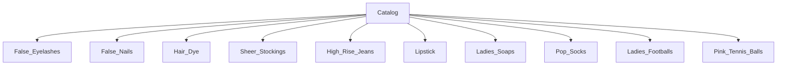

# Product Specification Addendum: Pink Tennis Balls

**Repository:** [`misterfitzy/false-eyelash-store`](https://github.com/misterfitzy/false-eyelash-store)
**Spec Location:** `specs/product-spec.md`
**Date:** 27-Apr-2026

---

## Overview

**Pink Tennis Balls** is a new, filterable, and scalable product category for the store. This specification includes shopper and admin features, updated data models, filtering controls, admin workflows, and accessibility requirements.

---

## Catalog & Navigation

- Pink Tennis Balls is a top-level navigation category alongside existing top categories (e.g. False Eyelashes, False Nails, Lipstick, Footballs, Pop Socks, etc.).



---

## Shopper Features & Filters

**Filter dimensions:**
- Brand (Wilson, Slazenger, Head, Penn, etc.)
- Color (Pink, Multi, Neon, Custom)
- Pack Size (1, 3, 4, 6, 12, 24, etc.)
- Ball Type (Standard, Pressureless, Championship, Training, Kids)
- Material (Felt, Rubber, Eco, Vegan, Recycled)
- Features (Extra Bounce, Indoor/Outdoor, Limited Edition, Custom Print)
- In Stock Only (toggle)
- Price Range ($ slider)
- Rating (1–5 stars)

**Sort options:** Price, Newest, Best Rated, Brand

**Product detail page:**
- Gallery images (angles, close-up, packaging, on-court)
- Badges: “Limited Edition”, “Charity” etc. (if applicable)
- Specs table: size, material, weight, bounce rating
- Bulk discounts by pack size
- Per-pack and per-ball inventory status
- Related items cross-sell (e.g., rackets, sweatbands)
- Shopper reviews, ratings, and Q&A
- Accessible swatch and pack selectors

**Mobile & accessibility:**
- Fully mobile and accessible; all filters and selectors WCAG 2.1 AA compliant
- Alt text for all images
- Large tap targets for variant/pack picking

---

## Admin Features

- Full CRUD for Pink Tennis Ball SKUs and variants (pack sizes, color, ball type, features)
- Bulk import/export via CSV/XLSX template with validation
- Spreadsheet-style batch editing for inventory and pricing
- Inline image and media management
- Tag as “Featured”, “Limited”, “Promo”, “Charity”, etc.
- Product activation/deactivation
- Inventory and sales analytics (by pack size, color, type)
- Review moderation and reporting
- Min/max inventory alerts

---

## Data Model Example

```json
{
  "id": "tennisball-pink-4pk-001",
  "category": "Pink Tennis Balls",
  "brand": "Wilson",
  "pack_size": 4,
  "ball_type": "Standard",
  "color": "Pink",
  "features": ["Limited Edition", "Extra Bounce", "Outdoor"],
  "material": "Felt",
  "price": 12.99,
  "status": "active",
  "inventory": 42,
  "image_urls": ["..."],
  "ratings": 4.8,
  "rating_count": 14,
  "badges": ["Limited Edition"],
  "description": "Wilson Pink Tennis Balls, perfect for both fun and serious play. 4-Pack."
}
```

---

## User Stories & Acceptance Criteria

**Shopper**
- As a shopper, I can browse and filter Pink Tennis Balls using all available dimensions
- As a shopper, I can see badges for limited/special editions and out-of-stock clearly
- As a shopper, I can view multiple images, full details, and reviews
- As a shopper, I can only add in-stock variants to cart

**Admin**
- As an admin, I can add/edit/delete tennis ball SKUs and all variant attributes
- As an admin, I can import/export tennis balls in bulk with validation checks
- As an admin, I can report on inventory and sales by color, pack, and type
- As an admin, I can tag and feature SKUs

---

## Accessibility & UI Guidance

- All filter panels and PDP controls are WCAG 2.1 AA+
- Distinct color contrasts for pink imagery vs. white backgrounds
- Alt text for all shots
- Fully responsive and mobile optimized

---

## Change History
- 27-Apr-2026: Add Pink Tennis Balls as a top-level category
- 20-Feb-2026: Add Ladies Footballs
- 21-Feb-2026: Add Pop Socks Mark 2
- 19–27-Feb-2026: Lipstick spec & data model enhancements
- 18-Feb-2026: High Rise Jeans, Hair Dye added
- 17-Feb-2026: False Nails added; store design initiated

---

## Next Steps
- [ ] Update wireframes for Pink Tennis Balls category and item detail pages
- [ ] Design initial import spreadsheet for tennis ball SKUs
- [ ] Prioritize features in dev implementation backlog


**Ready for UI design review and implementation.**
