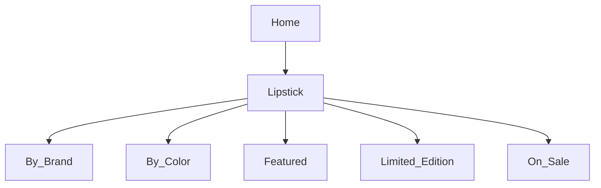

# Product Specification: Lipstick Feature  
_Repository: [false-eyelash-store](https://github.com/misterfitzy/false-eyelash-store)_  
_Spec Path: specs/product-spec.md_  
_Date: 2026-04-27_

---

## 1. Objective

- Establish Lipstick as a core, scalable product category.
- Enable robust, multi-facet filtering and variant (shade) management for shoppers.
- Allow admins full CRUD, import/export (CSV/XLSX), and reporting controls.
- Support catalog extensibility for future brand, promo, and digital experiences.

---

## 2. Store Navigation & Catalog Structure

Lipstick is a top-level navigation tab:

- False Eyelashes
- False Nails
- Sheer Stockings
- Hair Dye
- High Rise Jeans
- Lipstick (new/updated)
- Accessories (eyelash curlers, removers, etc.)



---

## 3. Shopper Filtering & Sorting

| Filter         | Type         | Examples                                   |
|----------------|--------------|--------------------------------------------|
| Brand          | Multi-select | MAC, NYX, Maybelline, Fenty, Revlon        |
| Color Family   | Multi-select | Red, Pink, Nude, Brown, Plum, Purple       |
| Finish         | Multi-select | Matte, Cream, Gloss, Satin, Metallic       |
| Form           | Multi-select | Bullet, Liquid, Crayon, Balm               |
| Features       | Multi-select | Vegan, Long-wear, Cruelty-free, SPF        |
| Price Range    | Slider       | $5–$50                                     |
| Rating         | Min stars    | 1–5                                        |
| In Stock Only  | Toggle       |                                            |
| Shade Name     | Text search  | “Ruby Woo”, “Blushing Nude”, etc.          |

**Sort:** Newest, Best Seller, Price, Rating, Brand

- Filter panel is sticky (desktop) and collapsible (mobile).
- Real-time update: "X results" count after filter applied.

---

## 4. Product Detail Page

- Visual, accessible shade picker (disables out-of-stock)
- Per-shade image, ingredient list, badges/feature tags, cross-sell area
- Add to Cart (requires in-stock shade), Wishlist, Reviews, Q&A
- All variant data (image, price, badges) updates on shade selection

---

## 5. Admin Features

- CRUD lipstick and all shade variants (with image, price, SKU, inventory, badges)
- Bulk CSV/XLSX import/export for all lipstick/shade data
- Tag with brand, finish, feature, sale/limited/featured/hidden status
- Bulk activate/deactivate, badge, or promote SKUs/shades
- Inventory/sales/status reporting by lipstick, shade, or tag

---

## 6. Data Model Example

```json
{
  "id": "lipstick-340",
  "name": "Luxe Stay Velvet",
  "brand": "Fenty",
  "form": "Liquid",
  "finish": "Matte",
  "features": ["Vegan", "Long-wear", "SPF 15"],
  "description": "High pigment, never-dry velvet matte.",
  "ingredients": ["Ingredient A", "Ingredient B"],
  "shades": [
    {
      "name": "Cherry Power",
      "color_family": "Red",
      "hex": "#B0171F",
      "sku": "FEN-LUXE-RED",
      "image_url": ".../cherry-power.png",
      "stock": 12
    },
    {
      "name": "Bare Silk",
      "color_family": "Nude",
      "hex": "#AD8366",
      "sku": "FEN-LUXE-NUDE",
      "image_url": ".../bare-silk.png",
      "stock": 10
    }
  ],
  "price": 17.99,
  "rating": 4.8,
  "rating_count": 193,
  "status": "active"
}
```

---

## 7. Acceptance Criteria

**Shopper**
- Can filter, search, and add only in-stock lipstick shade to cart.
- All shade information (image, badges, ingredient, price) is current/accurate.

**Admin**
- Full CRUD and import/export for all lipstick/shade fields.
- Badging, catalog tagging, and activation consistent with shopper UI.
- All reporting/inventory tracking works for lipstick/catalog and shade/variant.

---

## 8. UI/UX

- Sticky/collapsible filter bar; real-time “X results” count
- Swatch selector: always accessible, instant image/info update
- Badges, ingredient, and price per-shade show prominently
- Admin: spreadsheet-style bulk edit, import/export, inline validation

---

## 9. Next Steps

1. Approve or provide edits to the spec.
2. Update wireframes (catalog, PDP, admin).
3. Implement stories for lipstick portfolio changes.

---

**This specification will now be committed to specs/product-spec.md in your repository.**

Pushing the update now.