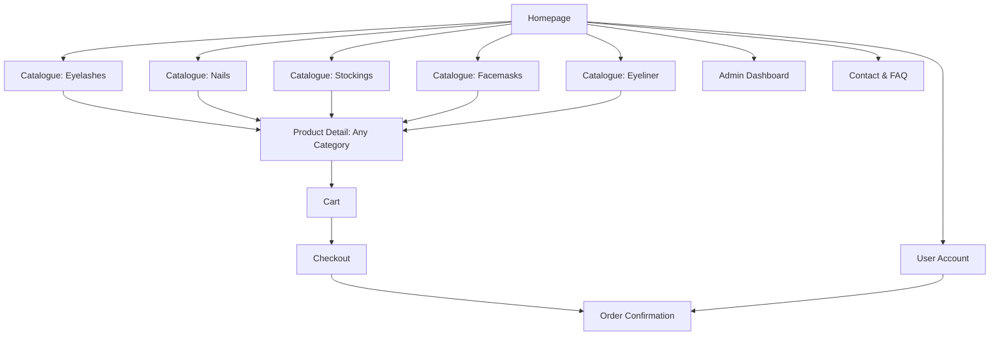

# Product Specification: Beauty Accessories E-commerce (False Eyelashes, False Nails, Sheer Stockings, Facemasks & Eyeliner)

## Overview

Enhance the e-commerce platform to support a fifth core category: eyeliner. Users should be able to find, filter, shop, and admins should manage eyeliners seamlessly alongside false eyelashes, false nails, sheer stockings, and facemasks.

---

## Goals

- Provide a seamless shopping experience for customers interested in false eyelashes, false nails, sheer stockings, facemasks, and eyeliner.
- Allow for efficient product management and order processing for all categories.
- Support mixed-category carts and a consistent admin experience.
- Continue supporting secure payments, mobile responsiveness, and accessibility.

---

## Target Users

- Beauty and fashion shoppers interested in lashes, nails, stockings, facemasks, or eyeliner.
- Small brands/retailers managing these beauty/fashion products.

---

## Key Features

1. **Homepage**
   - Hero banners, featured products sampled from all five categories, and clear navigation.

2. **Product Catalogue**
   - Category switcher/tabs/sidebar: "False Eyelashes", "False Nails", "Sheer Stockings", "Facemasks", **"Eyeliner"**.
   - Catalogue for each category—including eyeliner.
   - Filtering/sorting per category.
   - **Eyeliner-specific filters**: type (Liquid, Pencil, Gel, Felt-tip, Powder, etc.), shade/color, finish (matte, gloss, shimmer, satin, etc.), waterproof (yes/no), brand, price.

3. **Product Detail Page**
   - High-res photos, full description, price, and selection for category-relevant options (incl. type, shade, finish, waterproof for eyeliners).
   - Category label and breadcrumbs.
   - Reviews, ratings, and Add to Cart.

4. **Shopping Cart**
   - Supports mixed-product carts across all categories.
   - Quantity and attribute selection visible per item.

5. **Checkout & Payment**
   - Multi-category purchasing is supported with no workflow change.

6. **Order Confirmation & Tracking**
   - Orders include eyeliner line items where applicable.

7. **Admin Dashboard**
   - Manage all five categories, including eyeliner.
   - Add/edit/delete eyeliner products; fields: name, description, photos, SKU, price, stock, type, shade, finish, waterproof, brand, tags, features, ingredients.
   - Manage orders, including those with multi-category products.

8. **User Account (optional)**
   - See eyeliner in purchase history.

9. **Contact & FAQ**
   - Expanded with advice for eyeliner use, removal, and care.

---

## Information Architecture / Site Map



---

## Data Model: Eyeliner Example

```json
{
  "category": "eyeliner",
  "name": "Perfect Line Waterproof Gel Eyeliner",
  "images": ["eyeliner1.png", "eyeliner2.png"],
  "price": 13.99,
  "stock": 200,
  "attributes": {
    "type": "Gel",
    "shade": "Jet Black",
    "finish": "Matte",
    "waterproof": true,
    "brand": "ProLash",
    "size": "3ml",
    "ingredients": ["Aqua", "Cetearyl Alcohol", "..."]
  },
  "description": "Intense color, all-day wear waterproof gel eyeliner in jet black."
}
```

---

## User Stories

### Shopper
- As a user, I can browse, filter, and search eyeliners by type, finish, waterproof, and shade.
- As a user, I can view eyeliner details, including images, all attributes, and add eyeliners to cart.
- As a user, I can purchase eyeliners alongside other products in a single order.

### Admin
- As an admin, I can add new eyeliner products with all relevant attributes (type, shade, finish, waterproof, brand, ingredients, size, etc).
- As an admin, I can update or delete eyeliner listings.
- As an admin, I can filter or search the product catalog by category, including eyeliner.

---

## UI/UX Suggestions

- Main navigation shows "Eyeliner" alongside other categories.
- Filters on the eyeliner catalogue are immediately visible on desktop, collapsible on mobile.
- Eyeliner cards styled to match other product cards for visual consistency.
- Mobile-responsive and accessible per store baseline.

---

## Acceptance Criteria

- Eyeliner appears as a core product category in navigation.
- Catalogue, filtering, purchase, and admin flows support eyeliners.
- Orders and confirmation workflows include eyeliners.
- Mobile responsiveness and accessibility maintained sitewide.
- Mixed-category cart/checkout flows handle eyeliners gracefully.
- Admins have full CRUD and management for eyeliners.
- Data model supports all eyeliner-specific fields.
- UI/navigation/filters consistent with the rest of the app.

---

## Next Steps

1. Review and approve this updated spec.
2. Update or create wireframes for the new eyeliner category and filters.
3. Extend product and order data models for eyeliner-specific attributes.
4. Implement navigation/ui/backend changes and admin panel CRUD for eyeliners.
5. QA test shopper and admin flows including eyeliners and mixed-category baskets.

---

## Change Log
- 2026-02-17: Dual category (lashes/nails) support added.
- 2026-03-xx: Sheer stockings added as third category.
- 2026-04-xx: Facemasks added as fourth category; catalogue, detail, filter, admin, and purchasing flows updated.
- 2026-06-xx: Eyeliner added as fifth category; navigation, catalogue, admin and catalog flows updated for eyeliner.

---

**End of Spec Update**
