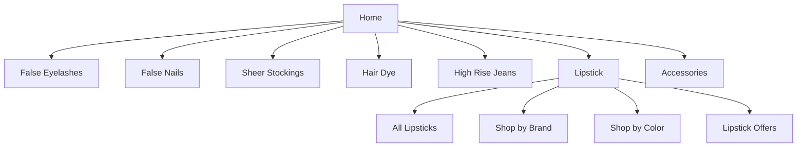
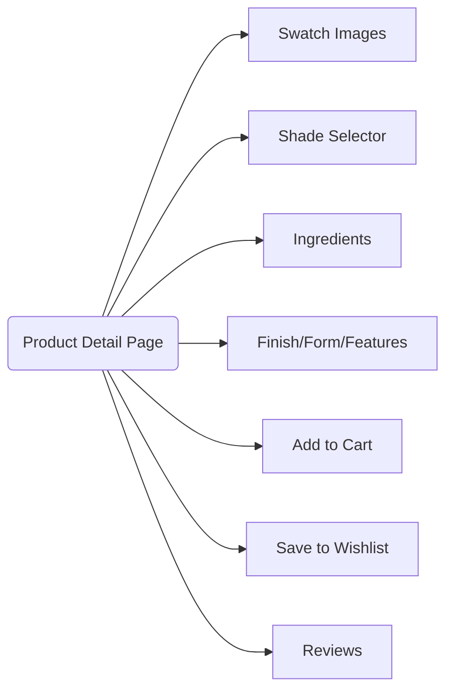

# Product Specification: Lipstick Feature (Update)
_Repository: [false-eyelash-store](https://github.com/misterfitzy/false-eyelash-store)_

## 1. Overview

The lipstick feature enables the e-commerce platform to support a sophisticated catalog, browsing, and purchase experience for lipstick products. This update sharpens the distinction between core categories, introduces advanced filtering, enables variant/shade management, provides full admin inventory control, and improves shopper and admin user journeys.

---

## 2. Catalog Integration and Navigation

**Lipstick** appears as a top-level category in primary navigation, alongside:
- False Eyelashes
- False Nails
- Sheer Stockings
- Hair Dye
- High Rise Jeans
- Accessories

### Mermaid: Category Navigation


---

## 3. Lipstick Catalog Filters & Sorting

### 3.1. Shopper-Facing Filters

Users can filter lipstick listings by:

| Filter             | Type           | Example Values                              |
|--------------------|----------------|---------------------------------------------|
| Brand              | Multi-select   | MAC, Maybelline, NYX, Fenty, etc.           |
| Color Family       | Multi-select   | Red, Pink, Nude, Brown, Plum, Purple, etc.  |
| Finish             | Multi-select   | Matte, Cream, Gloss, Satin, Metallic, Sheer |
| Form/Type          | Multi-select   | Bullet, Liquid, Crayon, Balm, Tint          |
| Key Features       | Multi-select   | Long-wear, Vegan, Cruelty-free, SPF, etc.   |
| Price Range        | Slider/range   | $5–$50                                      |
| Customer Rating    | Minimum stars  | 1–5                                         |
| In Stock Only      | Checkbox       |                                             |
| Shade Name         | Search         | “Ruby Woo”                                  |

### 3.2. Sorting Options
- Newest
- Best Selling
- Price (Low to High, High to Low)
- Rating (High to Low)
- Brand (A-Z)

---

## 4. Lipstick Product Detail Page

Each lipstick product page includes:

- High-res primary & alternate images (including on-lip/arm swatches per shade)
- Shade selection and real-time inventory
- Ingredient list
- Finish, form, and feature tags
- Full description and how-to-use section
- Add to Cart and Save to Wishlist
- Customer reviews, Q&A
- “See it on me” (optional/roadmap: AR swatch try-on)
- Cross-sell (“Pair with these lip liners”)

#### Mermaid: Product Detail Data Flow


---

## 5. Admin Panel Enhancements (Lipstick)

Admins can:
- Create/edit/delete lipstick SKUs with shade variants
- Manage inventory for each shade
- Upload/manage swatch and product images per color
- Mark key features (vegan, waterproof, limited edition, etc.)
- Edit price/discounts, status (in stock/out of stock/archived)
- Bulk import/update via CSV/Excel
- Generate sales and stock reports by brand, finish, etc.

---

## 6. Data Model Extensions

### 6.1. Updated Lipstick Product Model (JSON Example)
```json
{
  "id": "lipstick-002",
  "name": "Stay All Day Liquid Lipstick",
  "brand": "Stila",
  "form": "Liquid",
  "finish": "Matte",
  "features": ["Long-wear", "Vegan", "Transfer-proof", "SPF 15"],
  "description": "A comfortable, long-lasting liquid lipstick...",
  "ingredients": [
    "Isododecane",
    "Dimethicone",
    "Trimethylsiloxysilicate",
    "Synthetic Beeswax",
    "Silica"
  ],
  "shades": [
    {
      "name": "Beso",
      "color_family": "Red",
      "hex": "#A22620",
      "image_url": ".../beso.png",
      "stock": 12,
      "sku": "SL-LQMAT-BESO"
    },
    {
      "name": "Fiery",
      "color_family": "Red",
      "hex": "#C6001C",
      "image_url": ".../fiery.png",
      "stock": 7,
      "sku": "SL-LQMAT-FIERY"
    }
  ],
  "price": 22.99,
  "rating": 4.7,
  "rating_count": 381,
  "status": "active"
}
```

---

## 7. User Stories

### Shopper
- As a shopper, I can browse all lipsticks and filter by brand, shade, finish, and features.
- As a shopper, I can easily view in-stock shades and swatches before adding to my cart.
- As a shopper, I can compare lipsticks by price, rating, and finish.
- As a shopper, I can view lipstick ingredient lists to support informed purchases.

### Admin
- As an admin, I can upload new lipsticks and their shade variants.
- As an admin, I manage real-time stock/shade availability.
- As an admin, I bulk update lipstick inventory via spreadsheet imports.
- As an admin, I generate lipstick sales and inventory reports.

---

## 8. UI/UX Requirements

- Lipstick landing page prominently displays filter pills and quick-sort.
- Swatch selector is accessible (supports keyboard + screen readers), with responsive layout.
- Admin inventory/shade table supports inline editing, bulk adjustment, and quick image preview.
- Confirmation dialogs for destructive actions (delete SKU/shade).
- Consistent badge styling for “vegan,” “new,” limited edition.

---

## 9. Acceptance Criteria

- Lipstick category and filters are operational in the storefront and admin.
- Each lipstick product supports multiple shades, with stock tracked per shade.
- Swatch images/ingredient lists render accurately per selection.
- Admin can fully CRUD lipstick SKUs and track inventory at the shade level.
- Bulk import/export is available.
- Shopper flow from browse → filter → add-to-cart → checkout supports lipstick with shade selection.

---

## 10. Change History

| Date         | Change                                                               | By           |
|--------------|---------------------------------------------------------------------|--------------|
| 2026-02-19   | Lipstick added as new product category & feature set                | misterfitzy  |
| 2026-04-27   | Updated lipstick spec: advanced filters, shade mgmt, admin UX, data | ChatGPT PM   |

---

## 11. Next Steps

1. Review this updated specification for completeness and clarity.
2. Update wireframes and UI prototypes (storefront and admin).
3. Break down implementation tasks for development and QA.
4. Integrate new lipstick features into the dev sprint and deploy to staging.

---

**End of specification.**
