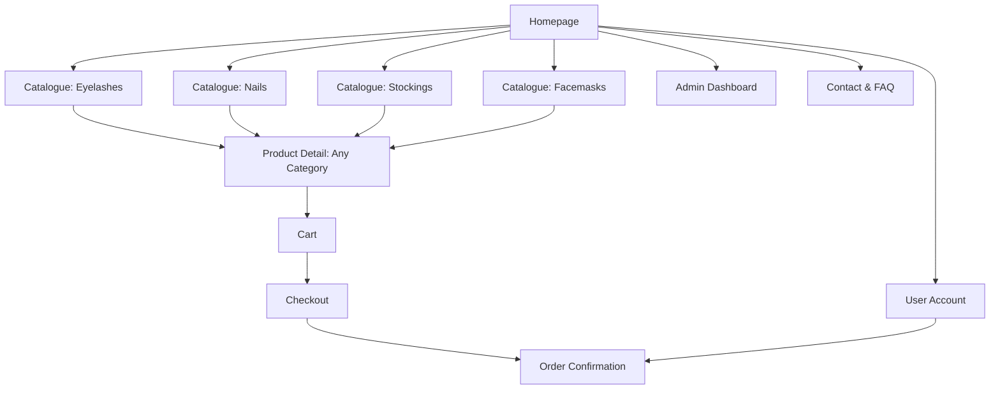

# Product Specification: Beauty Accessories E-commerce (False Eyelashes, False Nails, Sheer Stockings & Facemasks)

## Overview

Enhance the e-commerce platform to support a fourth category: facemasks. Users should be able to find, filter, shop, and admins should manage facemasks seamlessly alongside false eyelashes, false nails, and sheer stockings.

---

## Goals

- Provide a seamless shopping experience for customers interested in false eyelashes, false nails, sheer stockings, and facemasks.
- Allow for efficient product management and order processing for all categories.
- Support mixed-category carts and a consistent admin experience.
- Continue supporting secure payments, mobile responsiveness, and accessibility.

---

## Target Users

- Beauty and fashion shoppers interested in lashes, nails, stockings, or facemasks.
- Small brands/retailers managing these beauty/fashion products.

---

## Key Features

1. **Homepage**
   - Hero banners, featured products sampled from all four categories, and clear navigation.

2. **Product Catalogue**
   - Category switcher/tabs/sidebar: "False Eyelashes", "False Nails", "Sheer Stockings", "Facemasks".
   - Catalogue for each category—including facemasks.
   - Filtering/sorting per category.
   - Facemasks-specific filters: material, type, color/pattern, size, layers/protection, price.

3. **Product Detail Page**
   - High-res photos, full description, price, and selection for category-relevant options (e.g., size/color/layers for facemasks).
   - Category label and breadcrumbs.
   - Reviews, ratings, and Add to Cart.

4. **Shopping Cart**
   - Supports mixed-product carts across all categories.
   - Quantity and attribute selection visible per item.

5. **Checkout & Payment**
   - Multi-category purchasing is supported with no workflow change.

6. **Order Confirmation & Tracking**
   - Orders include facemask line items where applicable.

7. **Admin Dashboard**
   - Manage all four categories.
   - Add/edit/delete facemask products; fields: name, description, photos, SKU, price, stock, material, type, color/pattern, size, layers/protection, tags, features.
   - Manage orders, including those with multi-category products.

8. **User Account (optional)**
   - See facemasks in purchase history.

9. **Contact & FAQ**
   - Expanded with care advice for facemasks.

---

## Information Architecture / Site Map



---

## Data Model: Facemask Example

```json
{
  "category": "facemasks",
  "name": "Black Cotton Reusable Mask",
  "images": ["mask1.jpg", "mask2.jpg"],
  "price": 7.99,
  "stock": 150,
  "attributes": {
    "material": "Cotton",
    "type": "Reusable",
    "size": "Adult",
    "layers": "3-ply",
    "color_pattern": "Black",
    "features": ["Adjustable ear loops", "Nose wire"]
  },
  "description": "Comfortable adult cotton facemask with adjustable ear loops and nose wire for a secure fit."
}
```

---

## User Stories

### Shopper
- As a user, I can browse, filter, and search facemasks by material, size, type, and color.
- As a user, I can view facemask details, including images and all attributes, and add facemasks to cart.
- As a user, I can purchase facemasks alongside other products.

### Admin
- As an admin, I can add new facemask products with all relevant attributes (material, color, type, size, features, etc).
- As an admin, I can update or delete facemask listings.
- As an admin, I can filter or search the product catalog by category, including facemasks.

---

## UI/UX Suggestions

- Main navigation shows “Facemasks” alongside other categories.
- Filters on the facemask catalogue are immediately visible on desktop, collapsible on mobile.
- Facemask cards styled to match other product cards for visual consistency.
- Mobile-responsive and accessible per store baseline.

---

## Acceptance Criteria

- Facemasks appear as a core product category in navigation.
- Catalogue, filtering, purchase, and admin flows support facemasks.
- Orders and confirmation workflows include facemasks.
- Mobile responsiveness and accessibility maintained sitewide.
- Mixed-category cart/checkout flows handle facemasks gracefully.
- Admins have full CRUD and management for facemasks.
- Data model supports all facemask-specific fields.
- UI/navigation/filters consistent with the rest of the app.

---

## Next Steps

1. Review and approve this updated spec.
2. Update or create wireframes for the new facemask category and filters.
3. Extend product and order data models for facemask-specific attributes.
4. Implement navigation/ui/backend changes and admin panel CRUD for facemasks.
5. QA test shopper and admin flows including facemasks and mixed-category baskets.

---

## Change Log

- 2026-02-17: Dual category (lashes/nails) support added.
- 2026-03-xx: Sheer stockings added as third category.
- 2026-04-xx: Facemasks added as fourth category; catalogue, detail, filter, admin, and purchasing flows updated.

---

**End of Spec Update**
