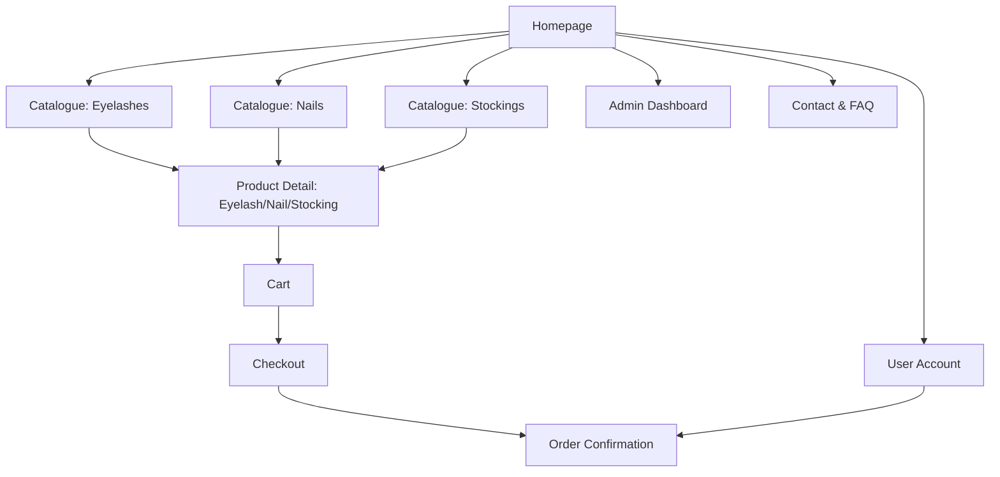

# Product Specification: Beauty Accessories E-commerce (False Eyelashes, False Nails & Sheer Stockings)

## Overview

Enhance the e-commerce platform to support a third category: sheer stockings. Users should find, shop, and admins should manage sheer stockings seamlessly alongside false eyelashes and false nails.

---

## Goals

- Provide a seamless shopping experience for customers interested in false eyelashes, false nails, and sheer stockings.
- Allow for efficient product management and order processing for all three core product categories.
- Support mixed-category carts and a consistent admin experience.
- Continue supporting secure payments, mobile responsiveness, and accessibility.

---

## Target Users

- Beauty and fashion shoppers interested in lashes, nails, and/or sheer stockings.
- Small brands/retailers managing these beauty/fashion products.

---

## Key Features

1. **Homepage**
   - Hero banners, featured products sampled from all three categories, and clear navigation.

2. **Product Catalogue**
   - Category switcher/tabs/sidebar: "False Eyelashes", "False Nails", "Sheer Stockings".
   - Catalogue for each category—now including stockings.
   - Filtering/sorting per category.
   - Stockings-specific filters: size, color, denier, style, price.

3. **Product Detail Page**
   - High-res photos, full description, price, selection for options (e.g., size/color/denier for stockings).
   - Category label and breadcrumbs.
   - Reviews, ratings, and Add to Cart.

4. **Shopping Cart**
   - Supports mixed-product carts across all categories.
   - Quantity and attribute selection visible.

5. **Checkout & Payment**
   - No change needed—system supports multi-category products.

6. **Order Confirmation & Tracking**
   - As above; orders include stockings line items where applicable.

7. **Admin Dashboard**
   - Manage all three categories.
   - Add/edit/delete sheer stocking products—fields: name, description, photos, SKU, price, stock, size, color, denier, tags.
   - Manage orders, including those with multi-category products.

8. **User Account (optional)**
   - See stockings in purchase history.

9. **Contact & FAQ**
   - Expanded with shipping/care advice for stockings.

---

## Information Architecture / Site Map

---

## User Stories

### Shopper

- As a user, I can browse sheer stockings by size, color, style, and denier, in addition to lashes and nails.
- As a user, I can filter stockings by relevant attributes.
- As a user, I can view detailed images and sizing guides for stockings.
- As a user, I can add any product type to my cart and purchase together.
- As a user, I receive order and shipping confirmations that enumerate all product types.

### Admin

- As an admin, I can add new sheer stocking products with size, color, denier, and image fields.
- As an admin, I can manage inventory and details for lashes, nails, and stockings.
- As an admin, I can view and manage orders by product category.

---

## UI/UX Suggestions

- Update navigation (tabs or sidebar) to visually balance all three product categories.
- Show relevant filters per category—stockings get size/color/denier selectors.
- Stockings catalogue: use lifestyle/model imagery, fabric closeups, size info.
- Product details: add a sizing guide/modal for stockings.

---

## Technology Recommendations

- **Frontend/Backend:** No changes; build upon current React/Vue/Next or Node/Django stack.
- **Database:** Add or extend product schema for a `category` field and stocking-specific attributes.
- **Payment/Hosting:** Continue with Stripe/PayPal and preferred web host.

---

## MVP Scope

- Stockings: full catalogue & detail pages, filters, admin CRUD, basket/checkout support, order/conf flows.
- Unified navigation and filter experience for all categories.

---

## Stretch Goals

- Category-specific promo banners (stockings sales, bundle offers).
- Cross-category "Shop the Look" (suggest lashes + nails + stockings).
- Advanced stockings filtering (material, pattern).
- Customer reviews by category/product.

---

## Acceptance Criteria

- Stockings appear as a core product category in navigation.
- Catalogue, filtering, purchase, and admin flows support stockings.
- Orders and confirmation workflows include stockings.
- Mobile responsiveness, accessibility maintained sitewide.

---

## Next Steps

1. Review and approve this spec.
2. Update or create wireframes for the new category and filters.
3. Extend product and order data models (add stockings-related fields).
4. Implement navigation/frontend/backend logic and admin panel CRUD forms for stockings.
5. QA test shopper and admin flows including stockings and mixed-category baskets.

---

## Change Log

- 2026-02-17: Dual category (lashes/nails) support added.
- 2026-03-xx: Sheer stockings added as third category; catalogue, detail, filter, admin, and purchasing flows updated accordingly.
