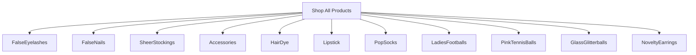

# Product Specification: Novelty Earrings Category
_Update for: `misterfitzy/false-eyelash-store`_
_Spec Location: `specs/product-spec.md`_

---

## 1. Overview

Add **Novelty Earrings** as a core, shoppable, filterable product category to the store. Support full catalog and admin flows, extensibility, product data model integration, accessibility, and reporting.

---

## 2. Catalog & Navigation Updates

- **Top-level Category:** Add "Novelty Earrings" to the primary catalogue navigation.
- **Menu Integration:** Include under Shop All and/or Accessories, as appropriate.
- **Searchable:** Products in this category are indexed for store search and can be found by name, type, theme, material, or color.

**Mermaid Diagram: Catalog Structure**


---

## 3. Shopper Features & Filters

**Shoppers can:**
- Browse Novelty Earrings via dedicated landing page.
- Filter and sort by:
  - **Type:** Studs, Dangles, Hoops, Cuffs, Clip-ons, Sets
  - **Theme:** Food, Animals, Holiday, Statement, Retro, Pop Culture, Custom/Text, Glitter/Gem, Other
  - **Material:** Metal (Nickel-Free, Sterling Silver, Gold-tone), Plastic, Resin, Acrylic, Wood, Fabric
  - **Colour:** Swatches, multi-select
  - **Finish:** Matte, Gloss, Glitter, Pearl, Holographic
  - **Brand**
  - **Closure:** Post, Hook, Clip-on, Magnetic
  - **Hypoallergenic:** Yes/No
  - **Featured/Trending**
  - **Price Range**
  - **Customer Ratings**
  - **Availability:** In stock, pre-order, out of stock
- Use quick view, add to wishlist/cart, and see live inventory status.
- View multiple images, video, 360° spins, and badges (e.g., Hypoallergenic, New).

---

## 4. Product Data Model (Example JSON)

```json
{
  "id": "e12345",
  "category": "Novelty Earrings",
  "name": "Glitter Donut Dangle Earrings",
  "brand": "FunBijoux",
  "type": "Dangles",
  "theme": ["Food", "Glitter"],
  "materials": ["Polymer Clay", "Nickel-Free Metal"],
  "colour": ["Pink", "White", "Sprinkles"],
  "finish": "Gloss",
  "closure": "Hook",
  "hypoallergenic": true,
  "description": "Whimsical donut-shaped dangle earrings with a glossy finish, lightweight and hypoallergenic.",
  "images": [
    "/images/earrings/donuts_1.jpg",
    "/images/earrings/donuts_2.jpg"
  ],
  "videos": [
    "/videos/earrings/donuts_demo.mp4"
  ],
  "badges": ["New Arrival", "Hypoallergenic"],
  "price": 8.99,
  "in_stock": 22,
  "rating": 4.7,
  "reviews_count": 17,
  "care": "Avoid water. Store in jewelry box.",
  "returnable": true,
  "tags": ["gift", "valentines"]
}
```

---

## 5. Admin Features

- **Full CRUD:** Create, edit, remove Novelty Earring products.
- **Bulk Import/Export:** Support inventory management for new SKUs via CSV/Excel.
- **Batch Editing:** Edit price, stock, attributes for multiple items.
- **Data Validation:** Enforce correct type, material, and naming formats.
- **Tag & Feature for Promotions:** Highlight new arrivals, bestsellers.
- **Sales & Inventory Reports:** Filterable for Novelty Earrings.

---

## 6. Accessibility & UX

- Images with alt text for product/photo/video assets.
- Sufficient contrast, large clickable filter controls, sticky filter panel (desktop), filter drawer (mobile).
- Full keyboard navigation for catalogs and product details.
- ARIA labels for custom controls.
- WCAG 2.1 AA compliance for all earrings-related UI.
- Upsell/cross-sell modules for related earrings and accessories.
- Quick-add or wishlist functionality.

---

## 7. User Stories

**Shopper**
- As a shopper, I can browse and filter novelty earrings by type, theme, and colour.
- As a customer, I can filter hypoallergenic styles for sensitive skin.
- As a shopper, I can see detailed images/videos before purchase.
- As a customer, I can combine earrings with other items in my cart and checkout together.

**Admin**
- As an admin, I can bulk upload or edit SKUs with all novelty earring attributes.
- As an admin, I can filter and report on earrings inventory or sales.
- As an admin, I can tag earrings for "New Arrival" and "Promotions." 

---

## 8. Acceptance Criteria

- [ ] Novelty Earrings category visible in catalog and navigation.
- [ ] Shopper can filter, sort, purchase, add to wishlist/cart, and see live inventory.
- [ ] Admin can CRUD single and multiple earring SKUs, import/export, and report.
- [ ] Mixed-category cart/checkout is seamless.
- [ ] Meets WCAG 2.1 AA accessibility for all earrings UI.
- [ ] Product data model supports all earring-specific attributes.

---

## 9. Next Steps

- **UI/UX:** Update wireframes for earrings (catalog, filters, PDP, cart).
- **Dev:** Implement as per above and validate with acceptance tests.
- **Design:** Create icons/images for earrings.
- **Content:** Write product detail, acquire demo media.
- **QA:** Confirm accessibility and filtering/reporting coverage.

---

## 10. Change History
- 2026-02-21: Added Novelty Earrings as a core, filterable product category

---

## 11. References
- [GitHub: misterfitzy/false-eyelash-store](https://github.com/misterfitzy/false-eyelash-store)
- Spec location: `specs/product-spec.md`

_This completes the formal integration of "Novelty Earrings" as a category in your e-commerce product spec._
