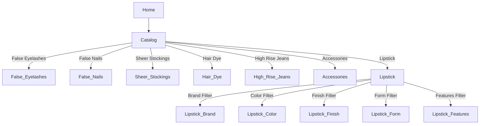

# Product Specification: Add "Lipstick" to Portfolio

## Overview
Expand the e-commerce platform to support "Lipstick" as a distinct core product category alongside existing categories (False Eyelashes, False Nails, Sheer Stockings, Hair Dye, High Rise Jeans, Accessories). This includes front-end catalog experience, advanced filtering, admin inventory management, data model updates, and shopper workflows for browsing and buying lipstick.

---

## Functional Requirements

### 1. Catalog Navigation
- Lipstick will appear as a top-level category in the main site navigation, homepage, and side menu.
- Users can browse all lipsticks or filter by key attributes.
- Lipstick products can be added to a mixed-category cart.

### 2. Lipstick Product Catalog Structure

#### Filters/Facets Supported:
- **Brand**
- **Color Family** (Reds, Pinks, Nudes, Berries, Plums, Browns, Corals, Unconventional)
- **Finish** (Matte, Satin, Glossy, Cream, Sheer, Metallic)
- **Form** (Bullet, Liquid, Crayon, Tube/Palette)
- **Features** (Long-Wear, Moisturizing, Vegan, Cruelty-Free, SPF, Plumping)
- **Price Range**
- **Rating**

#### Sorting:
- Price (Low to High, High to Low)
- Best Sellers
- Newest
- Top Rated

### 3. Product Detail Page
- Display lipstick-specific attributes.
- Swatch images/charts for each color option.
- "Try it on" virtual (future/optional).
- Full ingredient list, features (vegan, SPF, etc.), “How to use.”
- Add to cart, out-of-stock handling.

### 4. Admin: Lipstick Inventory Management
- Add/Edit/Remove lipstick products, including:
    - Multiple shades under one product (parent/child SKUs)
    - Brand association
    - Images per shade
    - Finish, form, features, price, inventory, description, ingredients
- Set visibility/featured status.
- Reports/filters for lipstick sales, inventory low/out-of-stock alerts.

### 5. Data Model Extension

#### Lipstick Product Example (JSON)
```json
{
  "id": "lskt-001",
  "category": "Lipstick",
  "brand": "Lush Lips",
  "name": "Velvet Matte Lipstick",
  "variants": [
    {
      "sku": "lskt-001-red01",
      "shade": "Classic Red",
      "color_family": "Red",
      "finish": "Matte",
      "swatch_image": "red01_swatch.png",
      "main_image": "red01.png",
      "inventory": 50
    },
    {
      "sku": "lskt-001-nude01",
      "shade": "Blushing Nude",
      "color_family": "Nude",
      "finish": "Matte",
      "swatch_image": "nude01_swatch.png",
      "main_image": "nude01.png",
      "inventory": 20
    }
  ],
  "form": "Bullet",
  "features": ["Long-Wear", "Vegan"],
  "price": 15.99,
  "description": "A creamy, long-wear matte lipstick available in a range of shades.",
  "ingredients": ["Candelilla Wax", "Shea Butter", "Color Pigments", "..."],
  "rating": 4.6,
  "is_featured": true,
  "visible": true
}
```

### 6. Core User Stories

#### Shopper
- As a customer, I want to filter lipstick by brand, color, finish, form, features, price, and rating.
- As a customer, I want to view each lipstick’s shades, ingredient list, and images.
- As a customer, I can add multiple lipstick shades (and other products) to my cart and checkout seamlessly.

#### Admin
- As a manager, I can CRUD all lipstick products & shades, including all category-specific attributes.
- As a manager, I see inventory and can generate lipstick sales/reorder reports.

---

## UI/UX Requirements

- Consistent navigation and styling as other core categories.
- Category-specific filter panel on lipstick catalog page.
- Each lipstick shade appears as a selectable swatch.
- Ingredient and feature icons on product cards and detail page.
- Responsive and accessible design.

#### Sample Catalog Navigation (Mermaid Diagram)

---

## Acceptance Criteria

- [ ] Lipstick is present in all navigation locations alongside other core categories.
- [ ] Shoppers can filter lipstick by all specified facets.
- [ ] Lipstick products show full details, attributes, swatches, and inventory status.
- [ ] Admins can fully manage lipstick SKUs and inventory.
- [ ] Lipstick purchases, inventory, and reporting function identically to other categories.
- [ ] Category, cart, and checkout flows are consistent and accessible.

---

## Next Steps

1. **Review & Approve Specification:** Confirm lipstick attributes, filters, and UI/UX expectations.
2. **Update UI Wireframes/Mockups** for lipstick catalog and product pages.
3. **Update Data Models/DB Schema** to add lipstick attributes & relationships.
4. **Implement Catalog, Admin, and Reporting Changes.**
5. **Test Filtering, Browsing, Admin CRUD, Cart, and Checkout for Lipstick.**
6. **Deploy and Announce Availability!**

---

## Change History

| Date       | Change                     | By        |
|------------|----------------------------|-----------|
| 2026-02-19 | Add lipstick specification | misterfitzy|

---

## JSON Example For a Lipstick Category Filter
```json
{
  "category": "Lipstick",
  "filters": {
    "brand": ["Lush Lips", "PoutPop", "UltraWear"],
    "color_family": ["Red", "Pink", "Nude", "Berry", "Plum", "Brown", "Coral", "Other"],
    "finish": ["Matte", "Satin", "Glossy", "Cream", "Sheer", "Metallic"],
    "form": ["Bullet", "Liquid", "Crayon", "Palette"],
    "features": ["Long-Wear", "Moisturizing", "Vegan", "Cruelty-Free", "SPF", "Plumping"],
    "price": { "min": 5, "max": 60 },
    "rating": { "min": 1, "max": 5 }
  }
}
```

---

_Lipstick is now a core part of the false-eyelash-store portfolio, with elegant filtering, management, and shopping workflows._

---
