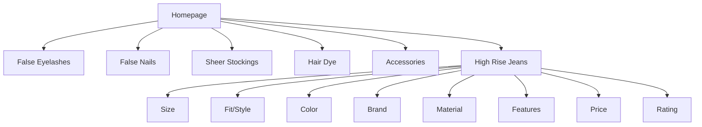

# Product Specification: Beauty/Fashion E-commerce – New Category: High Rise Jeans

## Overview
This is an incremental update to the platform specification, adding **High Rise Jeans** as a core, supported category. Shoppers can browse, filter, and purchase jeans with dedicated catalog and product pages; admins can fully manage jeans inventory, attributes, and sales data. This ensures the system supports continued multi-category growth, consistent workflows, and ease of catalog expansion.

---

## Goals
- Enable sale and management of high rise jeans alongside all current product categories (false eyelashes, nails, sheer stockings, hair dye, accessories).
- Provide full shopping, catalog browsing, filtering, and admin controls for the jeans category.
- Maintain UI/UX, data model, and workflow consistency for customers and admins.
- Continue supporting mixed-category carts, mobile responsiveness, and accessibility.

---

## Key Features Added

### 1. Homepage & Navigation
- "High Rise Jeans" shown as a main navigation tab, home featured grid, and on mobile menus.
- Product images and spotlights featuring jeans (as with other categories).
- Optionally include seasonal/promotional jeans banners.

### 2. Catalog Structure
- Jeans are a top-level selectable category in site nav and in the catalog sidebar/category list.
- Catalog grid displays jeans with thumbnails, quick view, rating, price, and size/fit preview.
- Filters for size, fit/style, color, brand, material, feature, price, and rating.

#### Site Map (Mermaid)


---
### 3. Filtering & Catalog UX
- **Jeans Filters:**
    - Size (numeric & S-3XL, depending on brand/data)
    - Fit/Style (Skinny, Straight, Flare, Boyfriend, Wide Leg, Mom, Relaxed, etc.)
    - Color (wash: Light, Medium, Dark, Black, White, Colored, etc.)
    - Brand
    - Material (cotton, stretch, organic, etc.)
    - Features (distressed, cuffed, cropped, button fly, raw hem, etc.)
    - Price (slider)
    - Rating (stars)
- Results update dynamically; filter chips/tags shown above grid.

### 4. Product Detail Page
- Multiple images, zoom, color/fit selector, detailed size chart link.
- Title, brand, price, sale (if any), badge/promo flags (Best Seller, New, etc.).
- In-stock status by size&color; Add to Cart; wishlist/fav button.
- Description, material, care, features.
- Reviews summary + full reviews section.

---

### 5. Admin Panel Extensions
- Jeans added as a category in inventory/product admin.
- Admin can add/edit/delete jeans with all attributes:
    - Title, brand, fits/styles, size options, colors/washes, material, features, images, price, badges, salePrice, inventory per SKU, description.
    - Batch/bulk upload (spreadsheet-style for sizes/fits); set featured or promo status.
- Sales and inventory reporting for jeans products; filter by attribute or variant.

---

### 6. Data Model Addition (Example JSON)
```json
{
  "id": "jean123",
  "category": "high-rise-jeans",
  "title": "High Rise Skinny Jeans",
  "brand": "DenimWorks",
  "sizes": ["24", "25", "26", "27", "28", "29", "30"],
  "fits": ["Skinny"],
  "colors": ["Light Wash", "Black"],
  "material": "Cotton, 2% Elastane",
  "features": ["Stretch", "Distressed Hem", "Cropped"],
  "price": 54.99,
  "salePrice": 44.99,
  "images": ["/images/jeans/jean123a.jpg"],
  "inventory": {
    "24": 12,
    "25": 7,
    "26": 0
  },
  "description": "Classic high rise skinny fit with a comfortable blend for all-day wear.",
  "badges": ["Best Seller"],
  "rating": 4.7,
  "numReviews": 54,
  "createdAt": "2026-02-19"
}
```

---

### 7. User Stories
#### Shopper
- As a user, I want to browse high rise jeans and filter by size, fit, color, and price.
- As a user, I want to read reviews, see size and fit guides, and check stock for my size.
- As a user, I can purchase jeans together with products from other categories.

#### Admin
- As an admin, I want to add and manage high rise jeans inventory by all new attributes.
- As an admin, I can edit prices, track stock, promote/badge jeans, and run reports on jeans items.

---
### 8. Acceptance Criteria
- [ ] High Rise Jeans visible as a top category in shop and admin views.
- [ ] Shoppers can filter, view, and purchase jeans; all fields/filters shown.
- [ ] Product detail, image gallery, size/fit/brand/feature display correctly for jeans.
- [ ] Admin can perform full CRUD and reporting for jeans; inventory by size tracked per SKU.
- [ ] Mixed-category cart/checkout ensures jeans merge with other item types.
- [ ] All new UI/UX for jeans is responsive, accessible, and test-covered.

---
### 9. Next Steps
1. Review and approve this spec update for "High Rise Jeans".
2. Update navigation, catalog/category logic, filters, admin interfaces, and backend API/models for jeans.
3. QA catalog, admin, and mixed-cart flows.
4. Add jeans images/assets and promotional content if desired.

---
**End of Spec Update: High Rise Jeans**
