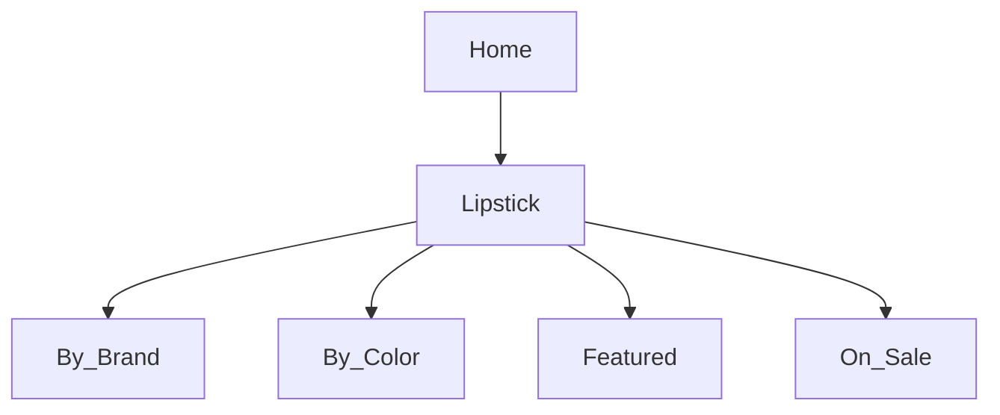

# Product Specification: Lipstick Feature  
_Repository: [false-eyelash-store](https://github.com/misterfitzy/false-eyelash-store)_  
_Spec Path: specs/product-spec.md_  
_Date: 2026-04-27_

---

## 1. Objective

Expand lipstick catalog control and shopper experience:
- Enable multi-attribute filtering, fast navigation, sorting
- Provide shade/variant inventory, image, price, and badge assignment
- Streamline admin CRUD and bulk workflows
- Ensure accessibility and scalability for growth

---

## 2. Store Navigation Structure

**Lipstick** will be a primary navigation category, with subcategories:
- By Brand
- By Color
- Featured/New
- On Sale



---

## 3. Shopper Filters & Sorting

| Filter         | Type         | Examples                                 |
|----------------|--------------|------------------------------------------|
| Brand          | Multi-select | MAC, Revlon, Fenty, NYX, Maybelline      |
| Color Family   | Multi-select | Red, Pink, Nude, Plum, Brown, Purple     |
| Finish         | Multi-select | Matte, Satin, Cream, Gloss, Metallic     |
| Form           | Multi-select | Bullet, Liquid, Crayon, Balm             |
| Features       | Multi-select | Vegan, Long-wear, Cruelty-free, SPF      |
| Price          | Slider       | $5–$50                                   |
| Rating         | Min stars    | 1–5                                      |
| In Stock Only  | Toggle       |                                          |
| Shade Name     | Text search  | “Ruby Woo” etc.                          |

Sort by: Newest, Best Seller, Price, Rating, Brand

---

## 4. Lipstick Product Page

- Shade/variant selector, disables OOS, instant per-shade image/price/badge
- Ingredients, features, badges, description, usage, review, and Q&A
- Add to cart: must pick shade & is in-stock
- Cross-sell: “Pairs with” recommendations (lip liner, accessories)

---

## 5. Admin Features

Admins can:
- Full CRUD for lipstick products and shades (with images, price, SKU, inventory)
- CSV/XLSX bulk import/export for all fields
- Bulk tagging, sales/feature badging, schedule promotions
- Activate, deactivate, or feature any SKU or shade
- Generate and export reports by lipstick, shade, or feature

---

## 6. Data Model (Example)

```json
{
  "id": "lip-202",
  "name": "Matte Luxe Long-Wear",
  "brand": "NYX",
  "form": "Liquid",
  "finish": "Matte",
  "features": ["Vegan", "Long-wear"],
  "description": "Comfort-matte, stays all day.",
  "ingredients": ["Ingredient A", "Ingredient B"],
  "shades": [
    {
      "name": "Fire Red",
      "color_family": "Red",
      "hex": "#B0171F",
      "sku": "NYX-LUXE-RED",
      "image_url": ".../fire-red.png",
      "stock": 21
    },
    {
      "name": "Cocoa Silk",
      "color_family": "Brown",
      "hex": "#AD8366",
      "sku": "NYX-LUXE-BROWN",
      "image_url": ".../cocoa-silk.png",
      "stock": 7
    }
  ],
  "price": 14.49,
  "rating": 4.7,
  "rating_count": 184,
  "status": "active"
}
```

---

## 7. Acceptance Criteria

**Shopper**
- All filter and sort functions work as specified
- Only in-stock variants are cart-enabled, all data accurate
- Product, shade selection, and images are accessible

**Admin**
- Lipstick and shade CRUD, tagging/editing via UI and import/export
- Catalog matches filtering, badges, and variants for shopper UX
- Reporting provides stock/sales/feature breakdowns for lipstick/shades

---

## 8. UI/UX

- Sticky/collapsible filter panel (mobile-friendly)
- Swatch selector always visible, instant image/badge/stock update
- All actions and components accessible (WCAG 2.1 AA+)
- Admin portal supports quick bulk edit, safety checks, CSV validation

---

## 9. Next Steps

1. Review and approve/amend this spec
2. Update catalog, PDP, and admin wireframes to match flows
3. Add relevant implementation tasks to the development backlog

---

Proceeding to commit this update to specs/product-spec.md in your repository.