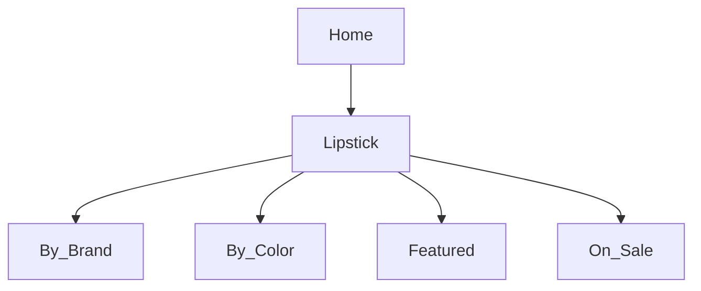

# Product Specification: Lipstick Feature Update  
_Repository: [false-eyelash-store](https://github.com/misterfitzy/false-eyelash-store)_  
_Spec Path: specs/product-spec.md_  
_Date: 2026-04-27_

---

## 1. Objective

Revamp the lipstick catalog and admin experience to:
- Support advanced filtering and search for shoppers
- Enable per-shade inventory and image handling
- Streamline admin SKU, variant, and bulk management
- Future-proof the data model for continued expansion

---

## 2. Catalog Position & Navigation

**Lipstick** is a top-level category in the store’s primary navigation, alongside:
- False Eyelashes
- False Nails
- Sheer Stockings
- Hair Dye
- High Rise Jeans
- Accessories



---

## 3. Lipstick Filtering & Sorting

| Filter         | Type         | Example Values                       |
|----------------|--------------|--------------------------------------|
| Brand          | Multi-select | MAC, NYX, Fenty, Maybelline, etc.    |
| Color Family   | Multi-select | Red, Nude, Pink, Plum, Brown, etc.   |
| Finish         | Multi-select | Matte, Cream, Gloss, Satin           |
| Form           | Multi-select | Bullet, Liquid, Crayon, Balm         |
| Key Features   | Multi-select | Vegan, Long-wear, Cruelty-free, SPF  |
| Price Range    | Slider       | $5–$50                               |
| Rating         | Min stars    | 1–5                                  |
| In Stock Only  | Toggle       |                                      |
| Shade Name     | Search       | “Ruby Woo” etc.                      |

**Sorting:** Newest, Best Seller, Price, Rating, Brand

---

## 4. Product Detail Page

Features per lipstick SKU:
- **Swatch selector:** Live, per-variant images, shows in-stock only
- **Dynamic images:** Main + on-lip/skin swatch for each shade
- **Attribute badges:** e.g., “Vegan”, “Limited Edition”
- **Ingredient list, usage/how-to, cross-sell suggestions**
- **Actions:** Add to cart (shade required), wishlist, Q&A, reviews

---

## 5. Admin Features

Admins can:
- Add/Edit/Delete lipsticks and all shades/variants
- Set per-shade price, stock, SKU/barcode, and image
- Tag lipsticks by brand, finish, features for robust filtering
- Bulk import/export all catalog fields via CSV/XLSX
- Activate/deactivate SKUs or shades individually
- Generate inventory and sales reports by lipstick/shade/feature

---

## 6. Data Model Sample

```json
{
  "id": "lipstick-015",
  "name": "Velvet Luxe Liquid",
  "brand": "NYX",
  "form": "Liquid",
  "finish": "Matte",
  "features": ["Vegan", "Long-wear"],
  "description": "Rich pigmentation, featherlight comfort.",
  "ingredients": ["Ingredient X", "Ingredient Y"],
  "shades": [
    {
      "name": "Classic Red",
      "color_family": "Red",
      "hex": "#C41E29",
      "sku": "NYX-MAT-RED",
      "image_url": "…/classic-red.png",
      "stock": 15
    },
    {
      "name": "Mocha Velvet",
      "color_family": "Brown",
      "hex": "#826A5C",
      "sku": "NYX-MAT-BROWN",
      "image_url": "…/mocha-velvet.png",
      "stock": 7
    }
  ],
  "price": 13.99,
  "rating": 4.6,
  "rating_count": 213,
  "status": "active"
}
```

---

## 7. User Stories & Acceptance Criteria

**Shopper:**
- Can filter, sort, and find only in-stock lipstick shades
- Can view per-shade inventory, images, and all key lipstick attributes
- Out-of-stock shades unselectable for cart

**Admin:**
- Full CRUD for lipstick and shade SKUs with media and inventory
- Can bulk manage/import/export all lipstick and shade data
- Can tag for filters, generate detailed stock/sales/low-stock reports

**Acceptance:**
- Filtering, sorting, and variant selection work as above (incl. accessibility)
- Only in-stock variants are selectable for add-to-cart
- Admin import/export, CRUD, and reporting operations function correctly

---

## 8. UI/UX Requirements

- Filter and sort bar always visible/sticky on desktop & collapsible on mobile
- Color swatch selector is highly visible, supports screen reader/keyboard usage
- Per-shade image & inventory, ingredient list, and feature badges update instantly
- Admin panel supports table view, bulk actions, and modals for edits

---

## 9. Next Steps

1. Approve spec or suggest further changes
2. Designer/dev to update wireframes for shopper & admin flows
3. Begin implementation backlog for catalog, detail page, and admin functions

---

**This specification will be committed to `specs/product-spec.md` in your repository.**
