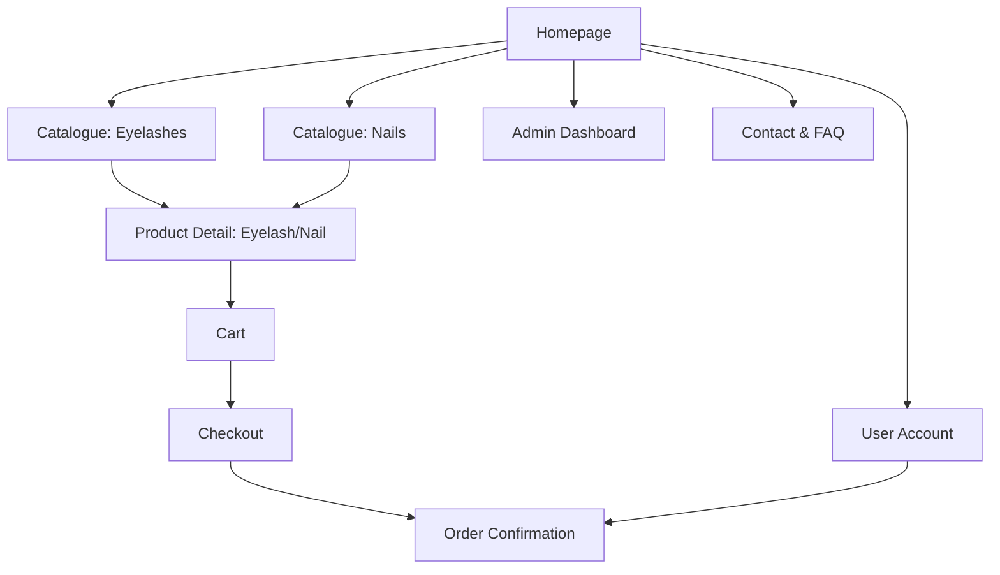

# Product Specification: Beauty Accessories E-commerce (False Eyelashes & False Nails)

## Overview

We are building a modern and user-friendly e-commerce website specializing in both false eyelashes and false nails. The website will enable users to browse diverse beauty accessories, view detailed product info, add items to cart, make purchases, and manage orders. Admins can add/update inventory for **eyelashes** and **nails** and process all types of orders.

---

## Goals

- Provide a seamless shopping experience for customers interested in both false eyelashes and false nails.
- Allow for easy product management and order processing for both product categories.
- Support secure payments and customer communication.
- Mobile responsive, accessible design.

---

## Target Users

- Beauty-conscious consumers interested in false eyelashes and/or false nails.
- Small beauty brands/retailers managing these product lines.

---

## Key Features

1. **Homepage**
   - Hero banner, featured products (from both categories), and call-to-actions.

2. **Product Catalogue**
   - Category toggle/filter: "False Eyelashes" and "False Nails".
   - Filters per category (e.g., eyelash style/length, nail shape/color/finish).
   - Search, sorting (price, popularity) within and across categories.

3. **Product Detail Page**
   - High-quality images, detailed description, price, category labels, reviews, Add to Cart.

4. **Shopping Cart**
   - Cart summary, adjust quantity, remove item, proceed to checkout.

5. **Checkout & Payment**
   - Address form, shipping options, payment integration (Stripe/PayPal).

6. **Order Confirmation & Tracking**
   - Email confirmation, order status page.

7. **Admin Dashboard**
   - Add/edit/delete eyelashes and nails.
   - View/manage orders.
   - Sales analytics (basic).

8. **User Account (optional)**
   - Register/login, order history.

9. **Contact & FAQ**
   - Contact form, answers to common questions.

---

## Information Architecture / Site Map

---

## User Stories

### Shopper

- As a user, I can browse false eyelashes **or** false nails by their respective styles and attributes.
- As a user, I can view high-quality details and photos for each eyelash or nail product.
- As a user, I can add or remove products to/from my shopping cart (mix and match types).
- As a user, I can securely purchase both types of products in a single transaction using credit card or PayPal.
- As a user, I receive an order confirmation email regardless of product type.
- As a returning user, I can log in and view past orders, including both eyelashes and nails.

### Admin

- As an admin, I can add new false eyelash **and** false nail products with detailed info and images.
- As an admin, I can edit or delete any product (lashes/nails).
- As an admin, I can view and manage all orders.
- As an admin, I can see sales analytics with breakdown by product category.

---

## UI/UX Suggestions

- Modern, beauty-focused look (soft colors, high-res imagery).
- Navigation to clearly distinguish eyelash and nail products.
- Category-based catalogue and filtering experience.
- Mobile-first, responsive design.
- Quick add-to-cart and visible pricing.
- Security and trust-building (testimonials, reviews, payment badges).

---

## Technology Recommendations

- **Frontend:** React.js, Next.js, or Vue.js.
- **Backend:** Node.js/Express or Python/Django.
- **Database:** PostgreSQL or MongoDB.
- **Payment:** Stripe or PayPal integration.
- **Hosting:** Vercel, Netlify, or AWS.
- **Optional CMS:** Sanity, Contentful.

---

## MVP Scope

- Homepage, dual product catalogue, product detail, cart, checkout/payment, order confirmation, admin dashboard with category support.
- Optional user authentication at launch.
- Contact form, FAQ page.

---

## Stretch Goals

- Product reviews and ratings for both categories.
- Wishlist/favorites.
- Advanced analytics by product type.
- Loyalty or discount system.

---

## Acceptance Criteria

- Users can browse, view, and purchase false eyelashes and false nails in a seamless flow.
- Admins can fully manage both product types and orders.
- All forms validated, errors handled gracefully.
- Secure website and transactions.
- Mobile responsive.

---

## Next Steps

1. Review and approve this spec.
2. Update wireframes to include nail category/catalogue, and adapt UI as needed.
3. Define extended product and order data models with category/tag support.
4. Update project board and break down added features into deliverable tasks.

---

**End of specification.**
