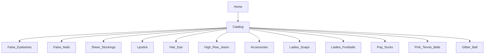

# Product Specification: Pink Tennis Balls Category

## 1. Overview

**Pink Tennis Balls** is a fully supported, filterable top-level product category for the e-commerce platform (false-eyelash-store). This document details the catalog structure, shopper/admin features, filtering, product data model, accessibility, and next steps.

---

## 2. Catalog Structure



---

## 3. Shopper Features

- Pink Tennis Balls listed in catalog with own top-level category page
- Glitter Ball listed as a top-level catalog category with a dedicated landing page
- **Filtering Options:**
    - **Brand** (e.g. Wilson, Slazenger, Penn, SparkleLight, PartyGlow, etc.)
    - **Color** (Pink, Silver, Gold, Multicolour, Custom, Mixed)
    - **Pack Size** (Single, 3-pack, 6-pack, Carton)
    - **Ball Type** (Practice, Competition, Pressureless)
    - **Size** (Mini, Standard, Large)
    - **Material** (Felt, Rubber composite, Acrylic, Polyethylene, Glass, Other)
    - **Features** (High-visibility, Extra bounce, Eco-friendly, Indoor/Outdoor, Motorized, Hanging, Remote-Controlled, Sound-Responsive)
    - **Intended Use** (Party, Events, Home Decor, Stage)
    - **Price** (sliding range)
    - **Rating** (1–5 stars)
    - **Inventory** ("In Stock Only" toggle)
- Catalog sorting: price, rating, newest, brand
- Product cards: add to cart, quick view, wishlist

**Product detail page:**
- Variant selector (Pack Size, Ball Type, Size, Color, Material)
- Dynamic stock per variant
- Display of all variant-specific features, images, descriptions
- Product reviews, Q&A
- Cross-sell related items
- Video support (rotating glitter ball, light effects)

---

## 4. Admin Features

- CRUD for Pink Tennis Balls and Glitter Ball products and all variant SKUs
- Import/export (.csv/.xlsx) of all related SKUs and attributes
- Batch-edit: price, availability, feature tagging, inventory
- Tagging (e.g. Bestseller, Party Must-Have, Limited Edition, Eco)
- Reporting on sales, inventory, and feature breakdowns
- Spreadsheet-style rapid-edit and inline validation
- Activation/deactivation of variants/products
- Admin-specific promo banners and badges for Glitter Ball
- Data model validation for all attributes

---

## 5. Product Data Model Example

```json
{
  "id": "glitterball-silver-small",
  "category": "Glitter Ball",
  "brand": "SparkleLight",
  "name": "Classic Silver Glitter Ball - Small",
  "size": "Small",
  "color": "Silver",
  "material": "Acrylic",
  "features": ["Hanging", "Sound-Responsive"],
  "intendedUse": ["Party", "Stage"],
  "price": 14.99,
  "inventory": 130,
  "rating": 4.7,
  "images": ["/img/glitterballs/silver-small-1.jpg"],
  "videos": ["/video/sparkle-silver-demo.mp4"],
  "description": "A classic silver glitter ball for any party or event...",
  "variants": [
    {"size": "Medium", "price": 19.99, "inventory": 70},
    {"size": "Large", "price": 29.99, "inventory": 22}
  ],
  "isActive": true,
  "badges": ["Party Must-Have"]
}
```

---

## 6. Accessibility

- All user/admin features WCAG 2.1 AA compliant
- Keyboard-accessible filter/variant selectors, live region feedback
- Alt text for all images, ARIA labels for controls and data grids
- Contrast, focus indicator, accessible error handling
- Responsive for mobile and desktop

---

## 7. Acceptance Criteria

**Shopper:**
- Can filter Pink Tennis Balls and Glitter Balls by any attribute, real-time updates
- Can only add in-stock variants to cart
- All product/variant data accurate with correct visuals and descriptions

**Admin:**
- CRUD, bulk actions, tagging, and reporting for both categories via admin dashboard and import/export
- Inline/bulk edits robustly validated
- Both categories managed like all core categories

**Accessibility:**
- All shopper/admin UI for both categories passes WCAG 2.1 AA checks

---

## 8. Next Steps
- [ ] Review and approve this specification
- [ ] Send to design for wireframes (catalog, detail, admin)
- [ ] Prepare data import templates (Pink Tennis Balls + Glitter Ball)
- [ ] Prioritize coding/design cards for feature implementation

---

## 9. Change History
- 2026-02-21: First full specification for Pink Tennis Balls, committed to repository
- 2026-04-27: Added Glitter Ball as core, filterable product category

---

## 10. References
- [GitHub: misterfitzy/false-eyelash-store](https://github.com/misterfitzy/false-eyelash-store)
- Spec location: `specs/product-spec.md`
