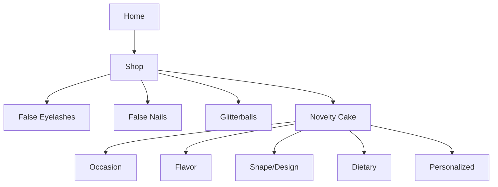

# Product Specification: Novelty Cake Category

## 1. Overview
Add "Novelty Cake" as a core, filterable category in the false-eyelash-store product catalog. This category covers physical novelty cakes for occasions (e.g., birthday, retirement, holidays) with advanced filtering, robust admin controls, WCAG 2.1 AA accessibility, detailed data modeling, and full shopper/admin features.

---

## 2. Goals
- Enable customers to browse, filter, and purchase novelty cakes.
- Provide advanced filtering by flavor, shape/design, occasion, allergy/suitability, size, dietary restrictions, personalization, price, and more.
- Support admin workflows for adding, editing, tagging, reporting, and managing novelty cakes.
- Ensure all flows meet accessibility requirements.

---

## 3. Shopper Features
- **Category navigation:** "Novelty Cake" visible in catalog; subcategories by occasion, flavor, etc.
- **Advanced filtering:** By flavor, shape, size, dietary needs (vegan, gluten-free, nut-free, etc.), serving count, color/design, occasion, personalized/not, price, rating, availability.
- **Sorting:** By newest, price, rating, bestsellers.
- **Product detail page:** Gallery, zoom, personalization options (text/photo upload), allergy & dietary info, reviews/q&a.
- **Variant selector:** Choose size, flavor, inscription.
- **Live inventory & delivery dates**
- **Wishlist/Save for later**
- **FAQ on shelf life, storage, allergens**
- **Review and Q&A**

---

## 4. Admin Features
- **CRUD for Novelty Cake products and variants**
- **Bulk import/export (CSV, XLSX)**
- **Batch editing for price, stock, availability**
- **Image & asset management (multiple images, alt text)**
- **Seasonal/event tagging (Christmas, Graduation, etc.)**
- **Promotional tagging**
- **Dietary/allergen attribute tagging**
- **Sales & inventory reporting**
- **Live/archived switching**
- **Validation (required fields, image format/sizing, allergy info)**
- **Rapid-edit for common fields**

---

## 5. Catalog Navigation & Filtering [Mermaid Diagram]


#### Filter Examples:
- Occasion (Birthday, Graduation, Baby Shower, Stag/Hen)
- Flavor (Chocolate, Vanilla, Carrot, Lemon)
- Shape/Design (Number, Character, Animal, Ball, Custom)
- Dietary (Vegan, Nut-Free, Gluten-Free, Halal, Kosher)
- Size/Servings (6”, 8”, Custom)
- Color/Theme
- Price
- In Stock/Preorder

---

## 6. Product Data Model (Example JSON)
```json
{
  "id": "cake-001",
  "title": "Football Pitch Birthday Cake",
  "category": "Novelty Cake",
  "occasions": ["Birthday", "Football Party"],
  "flavors": ["Chocolate", "Vanilla"],
  "shapes": ["Rectangle", "Football Pitch"],
  "theme_colors": ["Green", "White"],
  "serving_sizes": [
    { "size": "Small", "servings": 8, "price": 28.99, "sku": "cake-001-sm" },
    { "size": "Large", "servings": 18, "price": 48.99, "sku": "cake-001-lg" }
  ],
  "personalization": {
    "canPersonalize": true,
    "fields": ["message", "name", "age"]
  },
  "dietary_options": ["Nut-Free", "Vegetarian"],
  "allergens": ["Egg", "Dairy", "Wheat"],
  "images": [
    { "url": "football-cake-sm.jpg", "alt": "Football pitch birthday cake, small" }
  ],
  "inventory": 3,
  "delivery_options": ["Store Pickup", "Next-Day Delivery"],
  "reviews": [],
  "rating": 4.5,
  "isActive": true,
  "tags": ["Football", "Personalizable", "Best Seller"],
  "admin_notes": "Photographic upload for custom orders; check allergy details at intake."
}
```

---

## 7. Accessibility (WCAG 2.1 AA)
- All forms field-labeled, error states
- Color + icon coding for dietary/allergy tags
- Keyboard navigation for filters/personalization
- Alt text for all images
- Sufficient contrast and scalable fonts

---

## 8. Acceptance Criteria

**Shopper:**
- Can filter by all major cake attributes.
- Personalize cake for eligible SKUs.
- View ingredient/allergen info pre-purchase.
- Accessibly browse, select, and check out.

**Admin:**
- Add/edit/remove cakes/variants/personalization options.
- Batch tag for occasions, dietary, events.
- Export sales/inventory reports filtered by cake.
- Validate image, name, dietary/allergen for every new product.

---

## 9. User Stories

**As a shopper:**  
- I want to find cakes for specific occasions using filters.  
- I want to see only cakes that suit my dietary needs.  
- I want to personalize my cake with a message or photo.  
- I want clear allergy information.

**As an admin:**  
- I want to add/retire cakes available for sale.  
- I want to tag cakes for upcoming holidays or events.  
- I want reporting on cake sales and low inventory alerts.  
- I want to quickly update pricing and stock for cakes.

---

## 10. Next Steps
1. Approve this updated product specification.
2. Create/extend wireframes for the new Novelty Cake catalog & PDP features.
3. Model data updates for cake products in backend/service.
4. Implement catalog navigation and filtering components.
5. Add admin CRUD, import, and batch tools for the new category.
6. Test accessibility and workflows (shopper/admin).
7. Review acceptance criteria via QA.

---

## 11. Change Log
- 2026-02-21: Initial Novelty Cake category specification.  
- [Future]: Update for new regulation or feature as required.

---

**Ready for design team review and catalog integration.**  

---
