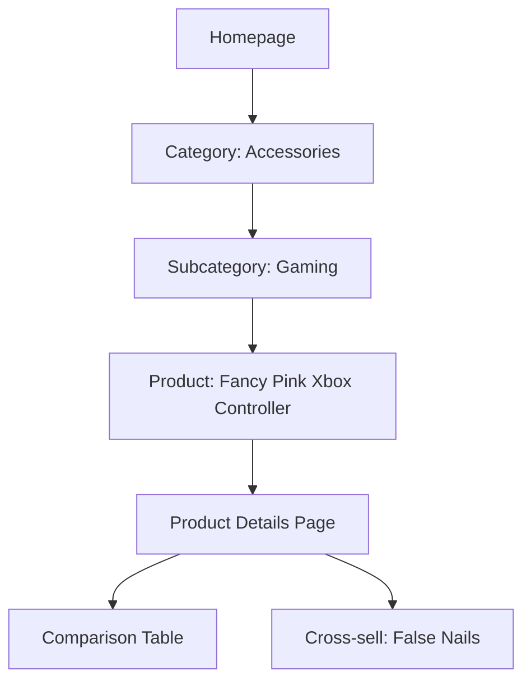

# Product Specification: Fancy Pink Xbox Controller for Long False Nails

_Last updated: 2026-04-28_

## 1. Overview

Add a new product (“Fancy Pink Xbox Controller – Nails Edition”) designed specifically for gamers who wear very long false nails. This controller should combine striking visual appeal (premium pink finish) with unique ergonomic modifications to allow safe, comfortable gaming with extra-long nails. The product should be included in the Accessories category, with discoverability features and attributes relevant to its unique audience.

## 2. Goals

- Expand accessory/product catalog to capture a new demographic: style-conscious gamers who wear false nails.
- Establish leadership in inclusive, fun gaming accessories.
- Enhance the “giftability” and cross-sell of beauty and lifestyle items in the store.

## 3. Target Users

- Gamers (predominantly women and non-binary individuals) who use long false nails.
- Customers looking for unique, fashionable or ergonomic gaming accessories.
- Shoppers searching for gift ideas blending beauty & gaming.

---

## 4. Key Features

### Product Features
- **Color:** Vibrant/fancy pink (high-quality finish, glitter or metallic accents optional).
- **Ergonomics:**  
  - Raised or shrouded button domes, spacing adapted for long nails  
  - Concave/tilted or extended triggers and bumpers  
  - Slim, indented D-pad and thumbsticks  
  - Anti-slip grips  
  - Optional removable nail-guard overlays
- **Platform:** Xbox Series S/X, compatibility with PC.
- **Wireless Functionality:** Bluetooth and USB.
- **Packaging:** Stylish, gift-worthy box.
- **Special Accessories:** Optional: matching pink nail set, cleaning cloth, storage pouch.

### Store/Platform Features
- Category: _Accessories > Gaming_
- Filtering: by color, compatibility, ergonomic suitability (“Nail Friendly”), brand, price.
- Advanced product page:  
  - Video demo showing ease of use with long nails  
  - Gallery: hand models wearing long false nails  
  - Detailed specs (dimensions, materials, warranty, compatibility)
  - Customer reviews (with photos)
- Cross-Selling: Show with false nails, glitter nail sets, and other “gamer glam” accessories
- Tags: `Gaming`, `Ergonomic`, `Nail Friendly`, `Pink`, `Gift`

---

## 5. Information Architecture & Site Map (mermaid)



## 6. Data Model Extension

```yaml
Product:
  - id: string
  - name: string ["Fancy Pink Xbox Controller – Nails Edition"]
  - category: string [Accessories]
  - subcategory: string [Gaming]
  - price: number
  - images: [string]
  - video_url: string
  - ergonomic_features: [string] # ["Nail Guard Buttons", "Concave Triggers", ...]
  - color: string ["Pink"]
  - compatible_platforms: [string]
  - tags: [string]
  - highlights: [string]
  - cross_sell_ids: [string]
  - gift_box: boolean
  - in_stock: boolean
  - review_ids: [string]
  - options: 
        - bundle_with_nails: boolean
        - removable_guards: boolean
  - created_at: datetime
  - updated_at: datetime
```

---

## 7. User Stories & Acceptance Criteria

### Shoppers
- **As a gamer with long nails**, I want to filter gaming accessories for “Nail Friendly” so I can see comfortable options.
  - _AC:_ “Nail Friendly” appears as a filter and on the controller’s product page.
- **As a style-conscious shopper**, I want thorough photos, demo video, and details to confirm it fits my style and needs.
  - _AC:_ Gallery includes at least 5 diverse images, demo video optional but highly encouraged.
- **As a gift shopper**, I want to see if it comes ready to gift and matches nail sets within the store.
  - _AC:_ Product page and cart promote bundle/cross-sells, packaging info.

### Admin
- **As a catalog admin**, I want to clearly add and manage ergonomic attributes, cross-selling, and highlight nail-friendly features.
  - _AC:_ Product admin allows selection of “Ergonomic: Nail Friendly,” cross-sell targets, and detailed specs.
- **As a marketing manager**, I want to tag and feature this product on landing pages and in search for “gamer girls”, “nail-friendly controller”, “pink Xbox”.
  - _AC:_ Product is easily discoverable through tags and promoted search.

### Accessibility/Compliance
- _AC:_ All images, videos, and variant selectors have accessible labels/descriptions. Color contrast meets AA minimums.

---

## 8. UI/UX Guidelines

- **Colorful, prominent product display – use pink-and-glam accenting.**
- Demonstrate unique ergonomic areas in annotated photos.
- Variant selectors: show “bundle with pink nails” as a prominent option.
- Demo video at top of product detail page.
- Accessibility: All controls keyboard/screen reader navigable, images with descriptive alt text.

---

## 9. MVP Scope

- Add category, product, and all required filtering/display for “Nail Friendly” gaming accessories.
- Seed store with Fancy Pink Xbox Controller, fully spec’d with images, feature badges, cross-sell.
- Cross-link with Nails category and related beauty/gaming gifts.

---

## 10. Testing & Acceptance

- Product appears correctly under Accessories > Gaming.
- “Nail Friendly” filter and badge work.
- Images and video confirm suitability for long false nails.
- Bundling and cross-sell to nails function as designed.
- Admin panel supports all custom attributes.
- Meets accessibility AA compliance.

---

## 11. Next Steps

- Approve/amend feature spec.
- Create wireframes/mocks showing product page, filtering, and cross-sell blocks.
- Add tasks for engineering & content (photo/video, product details, admin form).
- Extend product and filter models accordingly.
- Prepare admin onboarding for ergonomic attribute management.

---

_File Path for Spec: `specs/product-spec.md`_

---

### Ready for Design Agent

This spec is now workflow-ready and should be sent to the design agent for the next steps.
