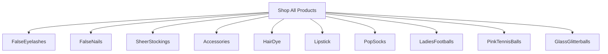

# Product Specification: Glass Glitterballs Category
_Update for: `misterfitzy/false-eyelash-store`_
_Spec Location: `specs/product-spec.md`_

---

## 1. Overview

Add **Glass Glitterballs** as a core, shoppable, filterable product category to the store. Support full catalog and admin flows, extensibility, product data model integration, accessibility, and reporting.

---

## 2. Catalog & Navigation Updates

- **Top-level Category:** Add "Glass Glitterballs" to the primary catalogue navigation.
- **Menu Integration:** Include under Shop All and/or Accessories, as appropriate.
- **Searchable:** Products in this category are indexed for store search and can be found by name, color, effect, or material.

**Mermaid Diagram: Catalog Structure**


---

## 3. Shopper Features & Filters

**Shoppers can:**
- Browse Glass Glitterballs via dedicated landing page.
- Filter and sort by:
  - **Color/Effect:** (e.g., Iridescent, Gold, Silver, Rainbow)
  - **Size (Diameter):** (e.g., 30mm, 50mm, 80mm, etc.)
  - **Base/Stand Included:** (Yes/No)
  - **Material Quality:** (e.g., Blown Glass, Solid Glass)
  - **Finish:** (Smooth, Faceted, Mirrored)
  - **Brand**
  - **In Stock**
  - **Price Range**
  - **Customer Ratings**
- Use quick view, add to wishlist/cart, and see live inventory status.
- View photos and videos for sparkle demonstration.

---

## 4. Product Data Model (Example JSON)

```json
{
  "id": "ggb-1001",
  "name": "Large Iridescent Glass Glitterball",
  "category": "Glass Glitterballs",
  "brand": "ShimmerCo",
  "description": "Handcrafted glass glitterball with rainbow iridescent finish. Perfect for decor, parties, or display.",
  "images": ["/img/ggb-1001-1.jpg", "/img/ggb-1001-2.jpg"],
  "video": "/vids/ggb-1001-demo.mp4",
  "color_effect": "Iridescent",
  "diameter_mm": 80,
  "base_stand_included": true,
  "finish": "Smooth",
  "material_type": "Blown Glass",
  "stock": 12,
  "price": 29.99,
  "rating": 4.8,
  "reviews": 22,
  "tags": ["decor", "gift", "sparkle"],
  "created_at": "2026-03-01T12:01:00Z"
}
```

---

## 5. Admin Features

- **Full CRUD:** Create, edit, remove Glass Glitterball products.
- **Bulk Import/Export:** Support inventory management for new SKUs via CSV/Excel.
- **Batch Editing:** Edit price, stock, attributes for multiple items.
- **Data Validation:** Enforce correct size, material, and naming formats.
- **Tag & Feature for Promotions:** Highlight new arrivals, bestsellers.
- **Sales & Inventory Reports:** Filterable for Glass Glitterballs.

---

## 6. Accessibility & UX

- Images with alt text for all product/photo/video assets.
- Sufficient contrast and large click targets for filter controls.
- Full keyboard navigation for catalogs and details.
- ARIA labels for custom controls.
- WCAG 2.1 AA compliance for product, filter, and multimedia display.

---

## 7. User Stories

**Shopper**
- As a shopper, I can browse a dedicated Glass Glitterballs category and filter by color, size, and finish.
- As a shopper, I can watch a video to see the ‘sparkle’ effect before purchase.
- As a shopper, I can choose quantities and check stock status in real time.

**Admin**
- As an admin, I can bulk upload new Glass Glitterballs with images, sizes, and features.
- As an admin, I can filter reports and inventory for only Glass Glitterballs.
- As an admin, I can tag items for seasonal promotions or bestsellers.

---

## 8. Acceptance Criteria

- [ ] Glass Glitterballs category visible in catalog and navigation.
- [ ] Shopper can filter, sort, and purchase, add to wishlist/cart, and see live inventory.
- [ ] Admin can CRUD single and multiple Glass Glitterballs, import/export, and report.
- [ ] Meets WCAG 2.1 AA accessibility for navigation, images, multimedia.
- [ ] Data model supports all core and custom attributes described.
- [ ] Can exist in a mixed-category cart/checkout with other items.

---

## 9. Next Steps

- **UI/UX:** Update wireframes to accommodate new filters, product features, and navigation.
- **Design:** Create icons/images for Glass Glitterballs.
- **Content:** Write initial product copy and acquire demo media.
- **Dev/QA:** Implement as per above, and validate with acceptance tests.

---

_This completes the formal integration of "Glass Glitterballs" as a category in your e-commerce product spec._

---

## 10. Change History
- 2026-04-27: Added Glass Glitterballs as a core, filterable product category

---

## 11. References
- [GitHub: misterfitzy/false-eyelash-store](https://github.com/misterfitzy/false-eyelash-store)
- Spec location: `specs/product-spec.md`
