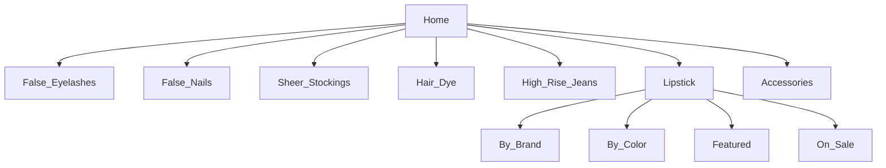

# Product Specification: Lipstick Feature  
_Repository: [false-eyelash-store](https://github.com/misterfitzy/false-eyelash-store)_  
_Spec Path: specs/product-spec.md_  
_Date: 2026-04-27_

---

## 1. Objective

Upgrade Lipstick to core catalog status with:
- Shopper-friendly, multi-attribute filtering and sorting
- Robust per-shade variant control (inventory, images, price, SKU)
- Admin-facing CRUD and bulk operations
- Extensible design for future seasonal/promotional growth

---

## 2. Store Catalog Integration

Lipstick is a top-level product type and navigation tab, beside:
- False Eyelashes
- False Nails
- Sheer Stockings
- Hair Dye
- High Rise Jeans
- Lipstick
- Accessories (e.g., eyelash curlers)



---

## 3. Catalog Features (Shopper)

| Filter         | Type         | Examples                                 |
|----------------|--------------|------------------------------------------|
| Brand          | Multi-select | MAC, NYX, Fenty, Maybelline              |
| Color Family   | Multi-select | Red, Nude, Pink, Brown, Plum, etc.       |
| Finish         | Multi-select | Matte, Cream, Gloss, Satin, Metallic     |
| Form           | Multi-select | Bullet, Liquid, Crayon, Balm             |
| Features       | Multi-select | Vegan, Long-wear, Cruelty-free, SPF      |
| Price Range    | Slider       | $5–$50                                   |
| Rating         | Min stars    | 1–5                                      |
| In Stock Only  | Toggle       |                                          |
| Shade Name     | Text search  | “Ruby Woo”, etc.                         |

**Sort:** Newest, Best Seller, Price, Rating, Brand  
**User Experience:** Sticky filter, “X results” feedback, instant updates

---

## 4. Product Detail Page

- **Shade/variant selector:** Images update per shade, OOS disabled
- **Product data:** Ingredients, badges (vegan, long-wear, etc.), usage/care instructions, Q&A, reviews
- **Cart:** Add-to-cart requires shade selection and in-stock
- **Cross-sell:** “Pairs well with…” (lip liners, removers, other store products)
- **Accessibility:** All controls fully accessible

---

## 5. Admin Features

Admins can:
- Add, edit, archive/delete lipsticks and per-shade SKUs
- Set per-shade price, image, inventory, SKU/barcode, and tags
- Bulk CSV/XLSX import/export all lipstick and variant data
- Tag for brand, finish, features, on sale, limited, or hidden status
- Activate, deactivate, or feature products at SKU/shade level
- Generate inventory and sales reports by lipstick, shade, or feature

---

## 6. Data Model Example

```json
{
  "id": "lipstick-260",
  "name": "Stay-Put Matte",
  "brand": "NYX",
  "form": "Liquid",
  "finish": "Matte",
  "features": ["Vegan", "Long-wear"],
  "description": "Bold, transfer-proof, comfort-matte lipstick.",
  "ingredients": ["Ingredient X", "Ingredient Y"],
  "shades": [
    {
      "name": "Berry Bold",
      "color_family": "Red",
      "hex": "#C41E29",
      "sku": "NYX-STAY-RED",
      "image_url": ".../berry-bold.png",
      "stock": 10
    },
    {
      "name": "Mocha Silk",
      "color_family": "Nude",
      "hex": "#AD8366",
      "sku": "NYX-STAY-NUDE",
      "image_url": ".../mocha-silk.png",
      "stock": 6
    }
  ],
  "price": 12.99,
  "rating": 4.8,
  "rating_count": 180,
  "status": "active"
}
```

---

## 7. Acceptance Criteria

**Shopper**
- Can filter, search, and select lipstick by any attribute
- Only in-stock variants are enabled for add-to-cart
- All info displayed is current and accurate, including badge, image, and price by shade

**Admin**
- Full CRUD and import/export workflows (UI + CSV)
- Easy tagging/editing at both SKU and shade
- Inventory, status, and reports work for lipstick and all variants

---

## 8. UI/UX

- Sticky/collapsible filter bar (mobile friendly)
- Swatch selector always visible, instant image update
- Highlighted badges for features and inventory
- Accessible controls, fully WCAG-compliant navigation

---

## 9. Next Steps

1. Approve or request modification of this spec
2. Update wireframes for lipstick and admin flow per new requirements
3. Add implementation steps to backlog

---

This specification will now be committed to `specs/product-spec.md` in your repository.
