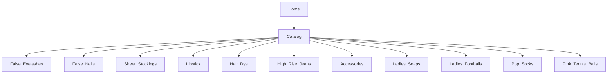

# Product Specification: Pink Tennis Balls Category

## 1. Overview

**Pink Tennis Balls** is a fully supported, filterable top-level product category for the e-commerce platform (false-eyelash-store). This document details the catalog structure, shopper/admin features, filtering, product data model, accessibility, and next steps.

---

## 2. Catalog Structure



---

## 3. Shopper Features

- Pink Tennis Balls listed in catalog with own top-level category page
- Filter options:
    - **Brand** (e.g. Wilson, Slazenger, Penn)
    - **Color** (Pink, Mixed)
    - **Pack Size** (Single, 3-pack, 6-pack, Carton)
    - **Ball Type** (Practice, Competition, Pressureless)
    - **Material** (Felt, Rubber composite)
    - **Features** (High-visibility, Extra bounce, Eco-friendly, Indoor/Outdoor)
    - **Price** (sliding range)
    - **Rating** (1–5 stars)
    - **Inventory** ("In Stock Only" toggle)
- Catalog sorting: price, rating, newest, brand
- Product cards: add to cart, quick view, wishlist

**Product detail page:**
- Variant selector (Pack Size, Ball Type)
- Dynamic stock per variant
- Display of all variant-specific features, images, descriptions
- Product reviews, Q&A
- Cross-sell related items

---

## 4. Admin Features

- CRUD for Pink Tennis Balls products and all variant SKUs
- Import/export (.csv/.xlsx) of all related SKUs and attributes
- Batch-edit: price, availability, feature tagging, inventory
- Tagging (e.g. Bestseller, Limited Edition, Eco)
- Reporting on sales, inventory, and feature breakdowns
- Spreadsheet-style rapid-edit and inline validation
- Activation/deactivation of variants/products

---

## 5. Product Data Model Example

```json
{
  "id": "pink-tennis-ball-001",
  "name": "Wilson Pink Tennis Balls",
  "brand": "Wilson",
  "description": "Premium felt, high-visibility pink tennis balls. Ideal for all courts.",
  "variants": [
    {
      "sku": "WIL-PINK-3PK",
      "pack_size": "3-pack",
      "ball_type": "Competition",
      "material": "Felt",
      "features": ["High-visibility", "Eco-friendly"],
      "color": "Pink",
      "price": 8.99,
      "stock": 24,
      "active": true
    }
  ],
  "images": [
    "https://example.com/img/wilson-pink-3pk-1.jpg",
    "https://example.com/img/wilson-pink-3pk-2.jpg"
  ],
  "rating": 4.6,
  "rating_count": 82,
  "tags": ["Bestseller", "Competition"],
  "status": "active"
}
```

---

## 6. Accessibility

- All user/admin features WCAG 2.1 AA compliant
- Keyboard-accessible filter/variant selectors, live region feedback for variant selection and stock
- Alt text for all images, ARIA labels for controls and data grids
- Clear error handling and warnings throughout bulk/batch actions

---

## 7. Acceptance Criteria

**Shopper:**
- Can filter Pink Tennis Balls by any attribute, and results update in real-time
- Can only add in-stock variants to cart
- All product/variant data accurate with correct visuals and descriptions

**Admin:**
- CRUD, bulk actions, tagging, and reporting available via admin dashboard and import/export
- Inline/bulk edits are robustly validated
- Pink Tennis Balls can be managed like all core categories

---

## 8. Next Steps

- [ ] Review and approve this specification
- [ ] Send to design for wireframes (catalog, detail, admin)
- [ ] Prepare data import templates
- [ ] Prioritize coding/design cards for Pink Tennis Balls feature

---

## 9. Change History

- 2026-02-21: First full specification for Pink Tennis Balls, committed to repository
- 2026-04-27: Confirmed presence and completeness; no changes required

---

## 10. References

- [GitHub: misterfitzy/false-eyelash-store](https://github.com/misterfitzy/false-eyelash-store)
- Spec location: `specs/product-spec.md`
