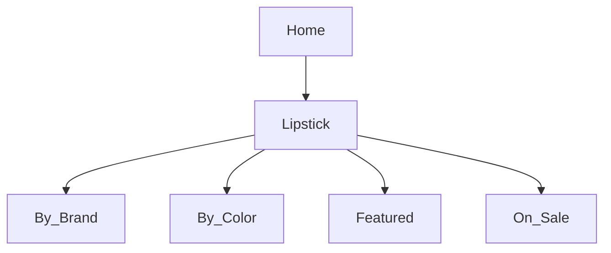

# Product Specification: Lipstick Feature (April 27, 2026 Update)
_Repository: [false-eyelash-store](https://github.com/misterfitzy/false-eyelash-store)_
_Spec Path: `specs/product-spec.md`_

---

## 1. Objective

Upgrade the lipstick category to:
- Allow advanced, shopper-friendly filtering and search
- Provide smooth per-shade image and inventory management
- Equip admins with strong CRUD, import/export, and reporting tools
- Enable ongoing catalog expansion

---

## 2. Catalog Position & Navigation

Lipstick is a top-level product category, matching other core offerings in navigation:
- False Eyelashes
- False Nails
- Sheer Stockings
- Hair Dye
- High Rise Jeans
- Lipstick
- Accessories



---

## 3. Shopper Filtering & Sorting

| Filter         | Type         | Example Values                        |
|----------------|--------------|---------------------------------------|
| Brand          | Multi-select | MAC, NYX, Fenty, Maybelline, etc.     |
| Color Family   | Multi-select | Red, Pink, Nude, Plum, Brown, etc.    |
| Finish         | Multi-select | Matte, Cream, Gloss, Satin, Metallic  |
| Form           | Multi-select | Bullet, Liquid, Crayon, Balm          |
| Features       | Multi-select | Vegan, Long-wear, Cruelty-free, SPF   |
| Price          | Slider       | $5–$50                                |
| Rating         | Min stars    | 1–5                                   |
| In Stock Only  | Toggle       |                                       |
| Shade Name     | Search       | “Pillow Talk”, “Ruby Woo”, etc.       |

Sort by: Newest, Best Seller, Price (asc/desc), Rating, Brand

---

## 4. Product Detail Page

Each lipstick SKU/entry offers:
- **Shade selector:** Per-variant images, grayed out if out-of-stock
- **Image panel:** Updates main/swatch image matching selected shade
- **Data fields:** Ingredient list, badges (vegan, waterproof, etc.), full description
- **Actions:** Add to cart (with shade required), wishlist
- **Cross-sell:** Lip liner, accessories (curlers, removers, etc.)
- **Reviews / Q&A:** Standard e-commerce UGC

---

## 5. Admin Features

Admins can:
- Full CRUD on lipstick SKUs and shade variants
- Set per-shade price, image, barcode/SKU, and inventory
- Bulk import/export all lipstick and shade fields (CSV/XLSX)
- Tag and promote lipsticks for filters, featured, or promo banners
- Generate reports (stock, sales, low inventory) by lipstick/shade/feature

---

## 6. Data Model Example

```json
{
  "id": "lipstick-020",
  "name": "All-Day Wonder Matte",
  "brand": "Maybelline",
  "form": "Liquid",
  "finish": "Matte",
  "features": ["Vegan", "Long-wear"],
  "description": "Vivid color, never dries lips out.",
  "ingredients": ["Ingredient X", "Ingredient Y"],
  "shades": [
    {
      "name": "Classic Red",
      "color_family": "Red",
      "hex": "#B0171F",
      "image_url": ".../classic-red.png",
      "stock": 27,
      "sku": "MAY-MAT-RED"
    },
    {
      "name": "Rose Haze",
      "color_family": "Pink",
      "hex": "#E75480",
      "image_url": ".../rose-haze.png",
      "stock": 15,
      "sku": "MAY-MAT-PINK"
    }
  ],
  "price": 13.89,
  "rating": 4.7,
  "rating_count": 169,
  "status": "active"
}
```

---

## 7. User Stories & Acceptance Criteria

**Shopper**
- Quickly find and filter lipsticks by brand, color, finish, features, or stock
- See only in-stock/shade-selectable options for purchase
- All relevant info (ingredients, features, images) always accurate

**Admin**
- Full CRUD, per-shade fields, and bulk import/export
- All catalog fields updatable, filter/tag controls match shopper UI
- Stock and sales reporting by shade and lipstick

---

## 8. UI/UX

- Sticky, accessible filter panel
- Swatch selector instantly updates images/inventory
- Responsive design and WCAG accessibility on key flows
- Admin table supports sorting and bulk actions

---

## 9. Next Steps

1. Approve/update this spec
2. Developer to update lipstick screens and admin as outlined
3. Move implementation tasks into sprint backlog

---

**This spec will be committed to your repository at `specs/product-spec.md`.**
