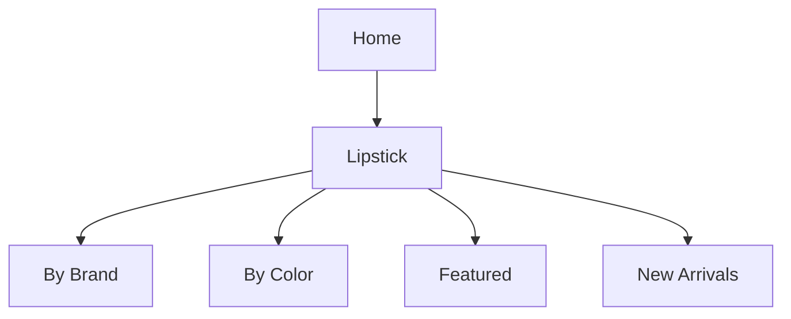

# Product Specification: Lipstick Feature (Update)
_Repository: [false-eyelash-store](https://github.com/misterfitzy/false-eyelash-store)_

## 1. Overview

The lipstick feature enables the e-commerce platform to support a sophisticated catalog, browsing, and purchase experience for lipstick products. This update sharpens the distinction between core categories, introduces advanced filtering, enables variant/shade management, provides full admin inventory control, and improves shopper and admin user journeys.

---

## 2. Catalog Integration and Navigation

**Lipstick** appears as a top-level category in primary navigation, alongside:
- False Eyelashes
- False Nails
- Sheer Stockings
- Hair Dye
- High Rise Jeans
- Accessories


---

## 3. Product Listing Filters & Sorting

Customers can filter lipsticks by:
| Filter          | Type         | Example Values                        |
|-----------------|--------------|---------------------------------------|
| Brand           | Multi-select | MAC, Revlon, Maybelline, NYX, Fenty   |
| Color           | Multi-select | Red, Pink, Nude, Plum, Brown, etc.    |
| Finish          | Multi-select | Matte, Cream, Satin, Gloss, Metallic  |
| Form            | Multi-select | Bullet, Liquid, Crayon, Balm          |
| Features        | Multi-select | Vegan, Long-wear, Waterproof, SPF     |
| Price           | Range slider | $5-$50                                |
| Shade name      | Text search  | e.g., “Ruby Woo”                      |
| Only in-stock   | Checkbox     |                                       |

**Sort by:** Newest, Best Seller, Price (Low–High/High–Low), Rating, A-Z

---

## 4. Product Detail Page Enhancements

For each lipstick:
- Display parent product & shade variants (with swatch & real-time stock)
- Images:
  - Main product
  - Per-shade swatch (optional on-lip/on-skin photo)
- Details: Full ingredient list, finish, features (badges), how-to-use/care
- CTAs: Add to cart (with shade selector), Save to Wish List
- Reviews, Q&A, Cross-sell (recommend matching lip liner)
- (Optional future) “Try It On” AR swatch tool

---

## 5. Admin Functionality

Admins can:
- Add/Edit/Delete lipstick SKUs with shades
- Set unique price, stock, image, and barcode/SKU for each shade
- Tag with brand, finish, product features, etc.
- Bulk import/export via CSV
- Run reports (stock by shade, sales by finish, etc.)
- Set product or shade status (in stock, out of stock, draft, archived)

---

## 6. Data Model (Example)

```json
{
  "id": "lip-001",
  "name": "Velvet Matte Lipstick",
  "brand": "Maybelline",
  "description": "...",
  "finish": "Matte",
  "form": "Bullet",
  "features": ["Vegan", "Long-wear"],
  "ingredients": ["Ingredient 1", "Ingredient 2"],
  "shades": [
    {
      "name": "Red Supreme",
      "color_family": "Red",
      "hex": "#b82b33",
      "sku": "MAY-LM-RED",
      "image_url": "https://.../red-supreme.png",
      "stock": 22
    },
    {
      "name": "Bare Blush",
      "color_family": "Nude",
      "hex": "#e3baad",
      "sku": "MAY-LM-NUDE",
      "image_url": "https://.../bare-blush.png",
      "stock": 8
    }
  ],
  "price": 10.99,
  "rating": 4.6,
  "rating_count": 117,
  "status": "active"
}
```

---

## 7. User Stories & Acceptance Criteria

#### Shopper
- Filter and sort lipsticks by key attributes
- Select in-stock shades before purchase
- Review ingredient & feature info

#### Admin
- Manage lipstick/shade lifecycle and stock
- Handle data in bulk
- Generate sales/inventory reports

#### Acceptance
- UI/UX for filtering and variants operational and tested for accessibility
- Admin CRUD, import/export, and reporting function as intended
- Shade-level inventory and per-shade image or swatch is consistent

---

## 8. UI/UX Guidelines

- Immediate feedback when filtering or switching shades
- Shade selection always visible and accessible
- Clear badge styling for “vegan”, “new”, “limited edition”
- Accessible swatch palette (keyboard/screen reader friendly)
- Confirmation for destructive actions

---

## 9. Change History & Next Steps

| Date       | Change                                           | By       |
|------------|--------------------------------------------------|----------|
| 2026-02-19 | Lipstick feature initial spec                    | User     |
| 2026-04-27 | Spec extended: filters, admin, data, UI/UX, AR   | ChatGPT  |

- **Next Steps:** Review this spec, provide feedback, prepare UI drafts, assign to development.

---

**This spec will be committed to** `specs/product-spec.md` **in your repository.**

---

