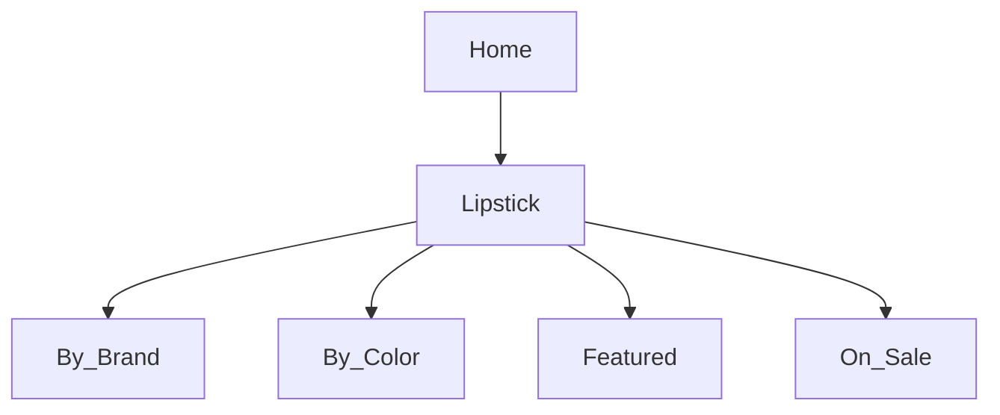

# Product Specification: Lipstick Feature (2026-04-27 Update)
_Repository: [false-eyelash-store](https://github.com/misterfitzy/false-eyelash-store)_  
_Spec Path: specs/product-spec.md_

---

## 1. Overview  
Enhance the lipstick category to deliver:
- Advanced real-time catalog filtering and sorting for shoppers
- Shade/variant-level inventory and media management
- Robust admin CRUD and bulk operations
- Future-extensible data modeling

---

## 2. Catalog & Navigation

**Primary Navigation:**
- False Eyelashes
- False Nails
- Sheer Stockings
- Hair Dye
- High Rise Jeans
- Lipstick (new/updated)
- Accessories

**Lipstick sub-navigation:**
- By Brand
- By Color
- Featured/New
- On Sale



---

## 3. Catalog Filter & Sorting (Shopper)

| Filter         | Type         | Example Values                       |
|----------------|--------------|--------------------------------------|
| Brand          | Multi-select | MAC, NYX, Maybelline, Fenty, etc.    |
| Color Family   | Multi-select | Red, Pink, Nude, Plum, Brown, etc.   |
| Finish         | Multi-select | Matte, Cream, Gloss, Satin, Metallic |
| Form           | Multi-select | Bullet, Liquid, Crayon, Balm         |
| Features       | Multi-select | Long-wear, Vegan, Cruelty-free       |
| Price Range    | Slider       | $5–$50                               |
| Rating         | Min stars    | 1–5                                  |
| In Stock Only  | Checkbox     |                                      |
| Shade Name     | Search       | “Ruby Woo”                           |

**Sort:** Newest, Best Seller, Price, Rating, Brand

---

## 4. Product Detail Page

- **Variant support:** Shopper can select lipstick shade, viewing per-variant images & live inventory
- **Display:** Swatch images, main image adjusts based on selected shade, ingredient disclosure, badges (e.g., “Vegan”)
- **Actions:** Add to Cart (requires shade), Wishlist, Review/Q&A, cross-sell (“Pairs with X Lip Liner”)
- **Accessibility:** Fully keyboard/screen reader accessible

---

## 5. Admin Features

- Add, edit, archive, or delete lipstick products and per-shade variants
- Assign per-shade price, barcode/SKU, inventory, image
- Tag with brand, finish, and features for filter compatibility
- Bulk inventory/price/shade import & export (CSV/XLSX)
- Sales, inventory, and promotion reporting
- Enable/disable shades or listings individually

---

## 6. Data Model (Sample)

```json
{
  "id": "lipstick-007",
  "name": "Infinite Color Matte",
  "brand": "NYX",
  "form": "Liquid",
  "finish": "Matte",
  "features": ["Vegan", "Long-wear"],
  "description": "Rich, lasting liquid pigment.",
  "ingredients": ["Ingredient A", "Ingredient B"],
  "shades": [
    {
      "name": "Scarlet Blaze",
      "color_family": "Red",
      "hex": "#C41E29",
      "image_url": ".../scarlet-blaze.png",
      "stock": 19,
      "sku": "NYX-MAT-RED"
    },
    {
      "name": "Cocoa Dusk",
      "color_family": "Brown",
      "hex": "#6D4534",
      "image_url": ".../cocoa-dusk.png",
      "stock": 8,
      "sku": "NYX-MAT-BROWN"
    }
  ],
  "price": 14.99,
  "rating": 4.7,
  "rating_count": 311,
  "status": "active"
}
```

---

## 7. User Stories & Acceptance Criteria

**Shopper**
- Can filter/browse by all above fields; instantly see only in-stock shades
- Product detail page always shows correct inventory/image per selected shade
- Cart add blocked for out-of-stock variants

**Admin**
- Full CRUD for lipstick SKUs and variants, with bulk import/export
- All filterable data updatable in Admin
- Report generation for inventory, sales by lipstick/shade

---

## 8. UI/UX Guidelines

- Sticky, accessible filter and sort bar
- Swatch panels: instant update on main image and stock
- Inputs/toggles with status indicators for admin

---

## 9. Next Steps

1. Approve and review spec
2. Detail UI wireframes for lipstick catalog and admin
3. Push stories for new filtering, variant, and admin features

---

**Committing this to specs/product-spec.md in your repository now.**
