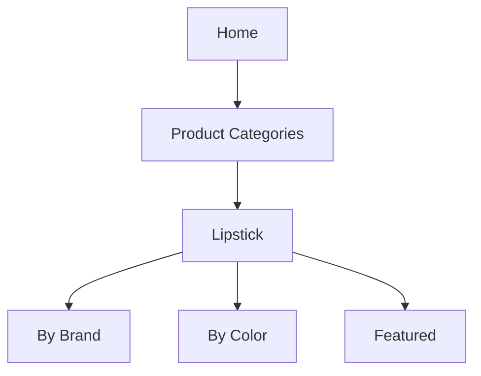

# Product Specification: Lipstick Feature (Update)
_Repository: [false-eyelash-store](https://github.com/misterfitzy/false-eyelash-store)_

## 1. Objective
Enhance the lipstick category to support:
- Advanced filtering and browsing (shopper experience)
- SKU/shade management (admin experience)
- Variant-level inventory and visual assets
- Data model extensibility for future expansion

---

## 2. Catalog & Navigation

**Lipstick** will be a core storefront navigation tab, alongside:
- False Eyelashes
- False Nails
- Sheer Stockings
- Hair Dye
- High Rise Jeans
- Accessories



---

## 3. Filter & Sorting Options (Shopper)

- **Brand** (multi-select: e.g., MAC, Fenty, NYX)
- **Color Family** (multi-select: red, nude, plum, etc.)
- **Finish** (multi-select: matte, cream, gloss, etc.)
- **Form** (multi-select: bullet, liquid, crayon, balm)
- **Key Features** (multi-select: vegan, waterproof, long-wear, etc.)
- **Price Range** (slider)
- **Customer Rating** (min star select)
- **In Stock Only** (toggle)
- **Shade name** (search)

**Sort by:** Newest, Best Selling, Price, Rating, Brand

---

## 4. Product Detail Page

Each lipstick SKU supports:
- **Swatch & Shade Picker:** Shows in-stock variants with images & live inventory
- **Images:** Product, shade swatch, and on-lip/skin photo (per-shade)
- **Details:** Ingredient list, feature badges, finish/form, usage guide
- **Actions:** Add to cart, wishlist
- **Reviews / Q&A:** User-generated content
- **Cross-sell:** Matching lip liner or recommended items

---

## 5. Admin Feature Set

Admins can:
- Add/edit/delete lipstick products and per-shade variants
- Set price, inventory, SKU, and image for each shade
- Tag products with multiple attributes (brand, features, etc.)
- Bulk update and bulk import/export (CSV)
- Report by sales/shade/feature/stock
- Set product/shade live status

---

## 6. Data Model (JSON Example)
```json
{
  "id": "lipstick-99",
  "name": "Super Stay Matte Ink",
  "brand": "Maybelline",
  "description": "High intensity color, long wear liquid lipstick.",
  "finish": "Matte",
  "form": "Liquid",
  "features": ["Long-wear", "Vegan"],
  "ingredients": ["Ingredient A", "Ingredient B"],
  "shades": [
    {
      "name": "Pioneer",
      "color_family": "Red",
      "hex": "#B90B27",
      "sku": "MAY-INK-RED",
      "image_url": ".../pioneer.png",
      "stock": 16
    },
    {
      "name": "Lover",
      "color_family": "Mauve",
      "hex": "#BC7B84",
      "sku": "MAY-INK-MAUVE",
      "image_url": ".../lover.png",
      "stock": 21
    }
  ],
  "price": 9.99,
  "rating": 4.5,
  "rating_count": 242,
  "status": "active"
}
```

---

## 7. UI/UX Requirements

- Shopper shade-picking is immediate, accessible, and shows live stock
- Filter bar is sticky and easy to clear
- Features (like “vegan” or “waterproof”) use consistent badge styling
- Per-shade swatch and images update main photo accordingly
- Admin panel bulk shade editing, import/export, and confirmation before destructive actions

---

## 8. User Stories & Acceptance Criteria

**Shopper**
- As a shopper, I can browse, filter, and sort lipsticks across multiple facets and see results in real time.
- As a shopper, I only see in-stock shades available for purchase and can clearly identify key product features.

**Admin**
- As an admin, I can manage lipstick SKUs and variants, including images, inventory, features, and bulk actions.
- As an admin, I can generate product reports and import/export data for lipstick SKUs and shades.

**Acceptance Criteria**
- Filtering, sorting, variant stock, and per-shade display are accurate and performant.
- Admin can fully CRUD lipstick products and all shade-level attributes.
- Data model supports easy future extension for additional lipstick features.

---

## 9. Change Log

| Date        | Update Summary                                   | By             |
|-------------|--------------------------------------------------|----------------|
| 2026-02-19  | Initial lipstick category spec                   | misterfitzy    |
| 2026-04-27  | Enh: advanced filters, SKUs, admin UX/data model | ChatGPT Agent  |

---

## 10. Next Steps

1. Review and approve this specification.
2. Wireframe new/updated lipstick catalog and admin screens.
3. Add/update stories to dev backlog for implementation and QA.

---

**This file will be committed to** `specs/product-spec.md` **in your repository.**

---
